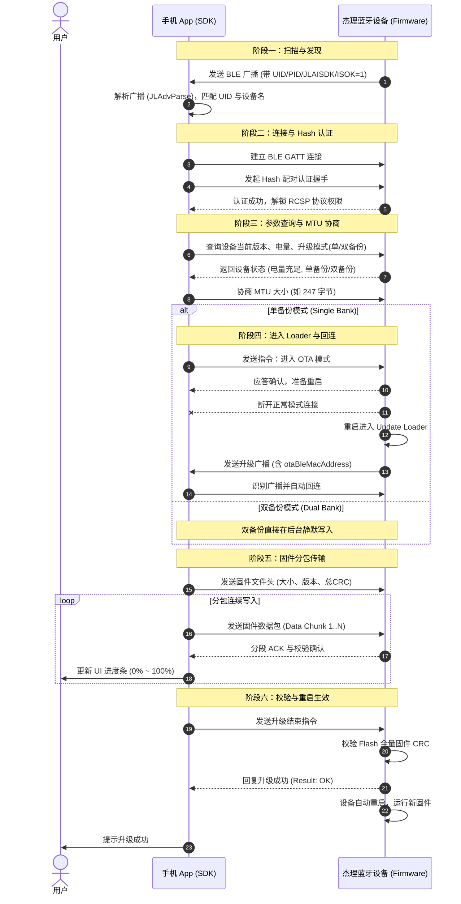

# 杰理（JieLi）芯片平台 OTA 固件升级全流程开发指南

---

## 目录
- [一、杰理官方资源与文档入口](#一杰理官方资源与文档入口)
- [二、杰理 OTA 核心架构与升级模式](#二杰理-ota-核心架构与升级模式)
  - [2.1 单备份升级（Single Bank / Loader 模式）](#21-单备份升级single-bank--loader-模式)
  - [2.2 双备份升级（Dual Bank / 无感后台升级）](#22-双备份升级dual-bank--无感后台升级)
  - [2.3 单/双备份特性对比](#23-单双备份特性对比)
- [三、杰理 BLE 广播数据（AdvData）深度解析](#三杰理-ble-广播数据advdata深度解析)
  - [3.1 广播包基础与厂商自定义数据（0xFF）](#31-广播包基础与厂商自定义数据0xff)
  - [3.2 SDK 广播解析字段字典详解](#32-sdk-广播解析字段字典详解)
  - [3.3 原始广播十六进制数据拆解实战](#33-原始广播十六进制数据拆解实战)
  - [3.4 设备类型枚举（JL_DeviceType）](#34-设备类型枚举jl_devicetype)
- [四、杰理 OTA 全生命周期交互时序与流程](#四杰理-ota-全生命周期交互时序与流程)
  - [4.1 阶段一：设备发现与广播过滤（Discovery & Filtering）](#41-阶段一设备发现与广播过滤discovery--filtering)
  - [4.2 阶段二：建立连接与 Hash 配对认证（Connect & Auth）](#42-阶段二建立连接与-hash-配对认证connect--auth)
  - [4.3 阶段三：OTA 参数查询与协商（Inquiry & MTU）](#43-阶段三ota-参数查询与协商inquiry--mtu)
  - [4.4 阶段四：准备进入升级模式与回连机制（Prepare & Reconnect）](#44-阶段四准备进入升级模式与回连机制prepare--reconnect)
  - [4.5 阶段五：固件分包传输与校验（Data Transfer & Verify）](#45-阶段五固件分包传输与校验data-transfer--verify)
  - [4.6 阶段六：升级完成与固件生效（Finish & Reboot）](#46-阶段六升级完成与固件生效finish--reboot)
  - [4.7 升级交互时序图（Mermaid）](#47-升级交互时序图mermaid)
- [五、异常处理、断点续传与强制升级](#五异常处理断点续传与强制升级)
  - [5.1 断点续传机制](#51-断点续传机制)
  - [5.2 强制升级（Force OTA / 救砖）](#52-强制升级force-ota--救砖)
  - [5.3 常见错误码及排查方向](#53-常见错误码及排查方向)

---

## 一、杰理官方资源与文档入口

| 平台 / 资源 | 验证状态 | 地址 / 链接 | 说明 |
| :--- | :---: | :--- | :--- |
| **杰理科技官网** | ✅ 正常 | [https://www.zh-jieli.com/](https://www.zh-jieli.com/) | 珠海市杰理科技股份有限公司官方门户 |
| **杰理官方文档系统** | ✅ 正常 | [https://doc.zh-jieli.com/](https://doc.zh-jieli.com/) | 官方在线文档系统（含各类芯片 SDK、RCSP 与 OTA 开发指南） |
| **Gitee 官方开源主页** | ✅ 正常 | [https://gitee.com/Jieli-Tech](https://gitee.com/Jieli-Tech) | 包含官方维护的各类开源项目 |
| **iOS OTA 官方仓库** | ✅ 正常 | [Gitee](https://gitee.com/Jieli-Tech/iOS-JL_OTA) / [GitHub](https://github.com/Jieli-Tech/iOS-JL_OTA) | 杰理 iOS 平台 OTA 升级 SDK 与 Demo |
| **Android OTA 官方仓库**| ✅ 正常 | [Gitee](https://gitee.com/Jieli-Tech/Android-JL_OTA) / [GitHub](https://github.com/Jieli-Tech/Android-JL_OTA) | 杰理 Android 平台 OTA 升级 SDK 与 Demo |
| **Flutter OTA 官方插件** | ✅ 正常 | [Gitee](https://gitee.com/Jieli-Tech/JL_OTA_Flutter) / [GitHub](https://github.com/Jieli-Tech/JL_OTA_Flutter) | 跨平台 Flutter OTA 插件与示例工程 |
| **微信小程序 OTA 仓库** | ✅ 正常 | [https://gitee.com/Jieli-Tech/WeChat-Mini-Program-OTA](https://gitee.com/Jieli-Tech/WeChat-Mini-Program-OTA) | 杰理微信小程序 OTA 升级方案 |

---

## 二、杰理 OTA 核心架构与升级模式

杰理芯片（如 AC690N、AC692N、AC695N、AC696N、AC701N、AC632N、JL701N 等）在固件设计上主要支持两种 OTA 升级架构：

```
                    ┌─────────────────────────┐
                    │    杰理 OTA 固件架构     │
                    └────────────┬────────────┘
                                 │
                 ┌───────────────┴───────────────┐
                 ▼                               ▼
      ┌─────────────────────┐         ┌─────────────────────┐
      │  单备份 (Single Bank) │         │  双备份 (Dual Bank)  │
      │  (需加载 Loader 重启) │         │  (后台无感静默写入)   │
      └─────────────────────┘         └─────────────────────┘
```

### 2.1 单备份升级（Single Bank / Loader 模式）
*   **适用场景**：Flash 存储空间较小（如 4Mbit / 512KB、8Mbit / 1MB）的经济型芯片。
*   **升级包文件**：通常为 `ota.bin`（内置 Update Loader）。
*   **运行原理**：
    1. 升级开始时，App 将升级用的 Loader 传输并写入芯片 VM 存储区；
    2. 设备自动重启并跳转至 RAM 或 Loader 区域运行；
    3. 设备发出专用的 OTA 升级广播（通常包含 `JLOTA` 标识或特殊广播包）；
    4. 手机 App 扫描到该广播后自动**重连（Reconnect）**设备；
    5. App 继续将真正的 App Code 固件数据直接写入 Flash 代码区覆盖旧代码；
    6. 写入校验通过后，设备重启进入新固件。
*   **特点**：极度节省 Flash 空间；但升级期间设备会断开重连，若写入中途中断可能会停留在 Loader 模式（需触发强制升级恢复）。

### 2.2 双备份升级（Dual Bank / 无感后台升级）
*   **适用场景**：Flash 空间充裕（通常 ≥ 16Mbit / 2MB）的高端音频/手表/通用 SoC。
*   **升级包文件**：通常为 `db_update_data.bin`。
*   **运行原理**：
    1. Flash 划分为两块对称或独立的程序区（Bank A 和 Bank B）；
    2. 当前在 Bank A 正常运行，App 直接在后台将新固件静默写入处于闲置状态的 Bank B；
    3. 传输过程中设备**不需要重启或断开蓝牙**，业务功能可正常保持；
    4. 写入完毕并进行完整性校验（Hash/CRC）无误后，App 发送重启生效指令；
    5. 设备重启，Bootloader 切换执行指针指向 Bank B，完成秒级生效。
*   **特点**：极高安全性（升级中途中断完全不影响原固件运行，绝不“变砖”），无需回连。

### 2.3 单/双备份特性对比

| 特性维度 | 单备份 (Single Bank) | 双备份 (Dual Bank) |
| :--- | :--- | :--- |
| **Flash 空间开销** | 极低（仅需少量 VM 空间存放 Loader） | 较高（需预留 2 倍 App 固件空间） |
| **升级包格式** | `ota.bin` | `db_update_data.bin` |
| **升级过程体验** | 需重启并断连，App 需回连升级广播 | 全程在线无感传输，无需断连回连 |
| **升级中断风险** | 需进入 Loader 恢复 / 强制升级 | 原固件完好无损，直接重新触发即可 |
| **固件互转** | 单双备份配置由固件编译和 Flash 布局决定，OTA 无法跨架构转换 |

---

## 三、杰理 BLE 广播数据（AdvData）深度解析

### 3.1 广播包基础与厂商自定义数据（0xFF）
杰理设备的 BLE 广播数据遵循标准 BLE 规范，由多个 AD Structure 组成。其中核心的设备标识、电量、状态及 OTA 回连信息主要封装在 **AD Type = `0xFF`（Manufacturer Specific Data / 厂商自定义数据）** 段中。
*   **杰理 SIG 厂商 ID（Vendor ID）**：`0x05D6`（十六进制小端字节序：`D6 05`，代表 *Zhuhai Jieli Technology Co.,Ltd*）。

### 3.2 SDK 广播解析字段字典详解

在 iOS 端调用 `[JLAdvParse bluetoothAdvParse:AdvData:]` 或 Android/Flutter 端解析广播包时，会生成如下字典结构：

```json
{
    "ADVDATA": "122502009900ec00a600fc00d60508004a4c414953444b",
    "BLE_NAME": "funf",
    "EDR": "",
    "ISBOUND": 0,
    "ISCHARGING": 0,
    "ISLINKED": 0,
    "ISOK": 1,
    "PID": "",
    "POWER": 0,
    "TYPE": "-1",
    "UID": 2512
}
```

| 字段名称 | 类型 | 取值示例 | 详细定义与业务作用 |
| :--- | :--- | :--- | :--- |
| **`ADVDATA`** | `HexString` | `12250200...` | **原始广播自定义数据**：从广播包中提取的 Manufacturer Data 十六进制字符串。 |
| **`BLE_NAME`** | `String` | `"funf"` | **低功耗蓝牙名称（Local Name）**：向外广播的设备名，用于列表展示与设备筛选。 |
| **`EDR`** | `String` | `""` 或 `"11:22:33:44:55:66"` | **经典蓝牙 MAC 地址**：杰理双模设备在 BLE 广播中携带的经典蓝牙地址，用于 App 触发静默配对。为空表示纯 BLE 或未配置 EDR 广播。 |
| **`ISBOUND`** | `Int/Bool` | `0 / 1` | **绑定配对状态**：`0` 未绑定，`1` 已绑定。配合杰理防蹭听/私有绑定认证协议。 |
| **`ISCHARGING`** | `Int/Bool` | `0 / 1` | **充电状态**：`0` 未充电，`1` 充电中。主要在耳机/充电仓/手环产品中指示电量状态。 |
| **`ISLINKED`** | `Int/Bool` | `0 / 1` | **经典蓝牙连接状态**：`0` 经典蓝牙未连，`1` 经典蓝牙已与手机建立 A2DP/HFP 链路。 |
| **`ISOK`** | `Int/Bool` | `0 / 1` | **数据合法与完整性校验**：<br>• `0`: 广播数据分包未全或未通过杰理私有协议校验；<br>• `1`: 广播数据完整且符合杰理协议规范。 |
| **`PID`** | `String/Int` | `""` 或 `1001` | **产品 ID（Product ID）**：标识具体产品型号，App 据此匹配对应的 UI 资源和固件文件。 |
| **`POWER`** | `Int` | `0 ~ 100` | **电池电量百分比**：当前设备剩余电量（0 表示未上报或使用外接电源）。 |
| **`TYPE`** | `String/Int` | `"-1"` | **设备形态类型**：对应 `JL_DeviceType` 枚举，`"-1"` 表示传统/通用透传/通用 OTA 设备。 |
| **`UID`** | `Int` | `2512` | **客户厂商唯一标识（User ID / Vendor ID）**：杰理分配给客户的专属厂商代码，用于防止误刷其他厂商设备。 |

### 3.3 原始广播十六进制数据拆解实战

以扫描到的广播数据 `122502009900ec00a600fc00d60508004a4c414953444b` 为例：

```
 12 25 │ 02 00 │ 99 00 ec 00 a6 00 fc 00 │ d6 05 │ 08 00 │ 4a 4c 41 49 53 44 4b
───────┼───────┼─────────────────────────┼───────┼───────┼───────────────────────
  UID  │ 版本/ │     设备自定义业务数据     │ 厂商ID │ 长度  │   ASCII: "JLAISDK"
 (2512)│  PID  │                         │(0x05D6)│       │   (杰理协议专属标识)
```

1. **`12 25`**：即 UID = 2512（0x2512 编码），用于识别品牌厂商。
2. **`d6 05`**：SIG 分配的杰理厂商代码 `0x05D6`。
3. **`4a 4c 41 49 53 44 4b`**：转换为 ASCII 字符串为 **`JLAISDK`**。
   - **为何数据 1 `ISOK = 0`？** 因为广播分包或只有前半段 `122502009900ec00a600fc00`，缺少了末尾的 `0x05D6` 和 `JLAISDK` 校验标记。
   - **为何数据 2 `ISOK = 1`？** 接收到了完整的带厂商信息和 `JLAISDK` 的完整包，解析库校验通过。

### 3.4 设备类型枚举（JL_DeviceType）

| 枚举值 | 标识名 | 设备类别 |
| :---: | :--- | :--- |
| **`-1`** | `JL_DeviceTypeTradition` | **传统设备 / 通用透传设备 / 通用 OTA 设备** |
| **`0`** | `JL_DeviceTypeSoundBox` | AI 音箱 |
| **`1`** | `JL_DeviceTypeChargingBin` | 智能充电仓 |
| **`2`** | `JL_DeviceTypeTWS` | TWS 双耳耳机 |
| **`3`** | `JL_DeviceTypeHeadset` | 普通单/双耳耳机、颈挂耳机 |
| **`4`** | `JL_DeviceTypeSoundCard` | 直播声卡设备 |
| **`5`** | `JL_DeviceTypeWatch` | 智能手表 / 手环设备 |

---

## 四、杰理 OTA 全生命周期交互时序与流程

杰理 OTA 的交互过程主要分为以下六个阶段：

```
[1. 扫描与过滤] ──> [2. 连接与认证] ──> [3. 参数查询/MTU] ──> [4. 准备与回连] ──> [5. 分包传输] ──> [6. 校验生效]
```

### 4.1 阶段一：设备发现与广播过滤（Discovery & Filtering）
1. 手机端开启 BLE 扫描；
2. 捕获广播包并调用 `[JLAdvParse bluetoothAdvParse:AdvData:]` 解析；
3. 检查 `ISOK == 1` 且 `UID`（或设备名 `BLE_NAME`）与目标一致；
4. 确认设备后停止扫描，准备发起连接。

### 4.2 阶段二：建立连接与 Hash 配对认证（Connect & Auth）
1. 建立 GATT 连接并发现杰理私有通讯服务与特征（如 RCSP 读写/Notify 通道）；
2. **重要安全步骤**：执行 **Hash 配对认证（Hash Auth）**。
   - App 与固件通过私有密钥算法生成随机挑战码与 Hash 签名；
   - 校验通过后，固件才允许解锁 RCSP 敏感指令及 OTA 升级权限。

### 4.3 阶段三：OTA 参数查询与协商（Inquiry & MTU）
1. **查询设备信息**：App 发送指令获取固件当前版本号、芯片架构、当前电量（通常要求电量 ≥ 20%~30% 防止断电）；
2. **查询升级模式**：获取当前固件支持的是**单备份**还是**双备份**；
3. **协商 MTU 与传输分包大小**：
   - 触发 BLE MTU 协商（如申请 MTU = 247 或 512）；
   - 根据协商结果设定每一包数据块（Block Size）的最佳长度以达到最高吞吐率。

### 4.4 阶段四：准备进入升级模式与回连机制（Prepare & Reconnect）
*   **如果是双备份（Dual Bank）**：直接跳转至阶段五，无需重启回连。
*   **如果是单备份（Single Bank）**：
    1. App 下发“进入升级模式”指令；
    2. 设备将 Loader 加载后主动断开当前蓝牙连接并重启；
    3. 设备以 OTA 模式广播（广播 Manufacturer Data 中携带原设备的 MAC 地址或带 `JLOTA` 标记）；
    4. App 端检测到蓝牙断开后，开启后台扫描，并通过 `[JLAdvParse otaBleMacAddress:isEqualToCBAdvDataManufacturerData:]` 匹配目标设备；
    5. App 快速重连（Reconnect）升级设备并重新建立数据通道。

### 4.5 阶段五：固件分包传输与校验（Data Transfer & Verify）
1. **下发文件头信息（Firmware Header）**：向设备发送固件总大小、CRC32 / MD5 校验和、版本信息；
2. **分块传输（Block Transmission）**：
   - App 按设定分包连续写入数据（支持 Write With Response 或 Write Without Response 流水线传输）；
   - 设备定期回复 ACK / 校验响应；
   - App 计算并向 UI 抛出当前升级进度百分比（Progress: 0% ~ 100%）。

### 4.6 阶段六：升级完成与固件生效（Finish & Reboot）
1. 固件全量数据发送完毕；
2. App 发送“传输完成与校验确认”指令；
3. 设备内部对写入的 Flash 数据做整体验证（CRC/Hash 校验）；
4. 设备回复升级成功响应并触发系统软复位（Reboot）；
5. 设备加载并运行全新固件版本，OTA 全流程完成。

---

### 4.7 升级交互时序图（Mermaid）



---

## 五、异常处理、断点续传与强制升级

### 5.1 断点续传机制
*   杰理 OTA 协议支持断点续传功能：
*   在传输过程中如果因信号不佳导致蓝牙异常断开，重新连接后，App 向设备查询当前已成功写入的偏移量（Offset），App 可直接从该 Offset 继续发送后续固件数据，避免从头重传。

### 5.2 强制升级（Force OTA / 救砖）
*   **触发场景**：设备升级单备份过程中被拔出电池、强行断电，导致原 App Code 已被部分擦除，开机直接停留在 Loader 模式（或者无法开机运行主程序）。
*   **处理流程**：
    1. 此时设备会持续发出专用的 Loader 修复广播（广播名通常包含 `OTA` / `JLOTA` / `OTA_XXXX`）；
    2. SDK 提供了强制升级 API（`NormalUpdate` / `ForceUpdate`）；
    3. App 扫描到带有强制升级标记的设备后，直接发起连接并重发完整固件进行覆盖修复。

### 5.3 常见错误码及排查方向

| 错误码 / 现象 | 产生原因 | 排查与解决对策 |
| :--- | :--- | :--- |
| **`0x4003` (CRC 错误)** | 固件分包或整体校验失败 | 检查升级文件是否匹配、检查蓝牙通信是否有丢包、尝试降低单包大小。 |
| **`0x4001` / 电量不足** | 设备电量低于阈值（如 < 30%） | 提示用户连接充电器或电量充足后再试。 |
| **回连超时（Timeout）** | 单备份重启后未在规定时间内扫描到回连广播 | 检查广播过滤逻辑，确认 `otaBleMacAddress` 对比方法是否正确调用。 |
| **Hash 认证失败** | 配对密钥不匹配或未经过认证 | 确认 App 端使用的 Pair Key 是否与固件端配置的秘钥一致。 |
| **广播解析 `ISOK = 0`** | 广播数据不完整 | 检查设备端广播包长度设置，确保未超过 31 字节上限或正确配置分包。 |
