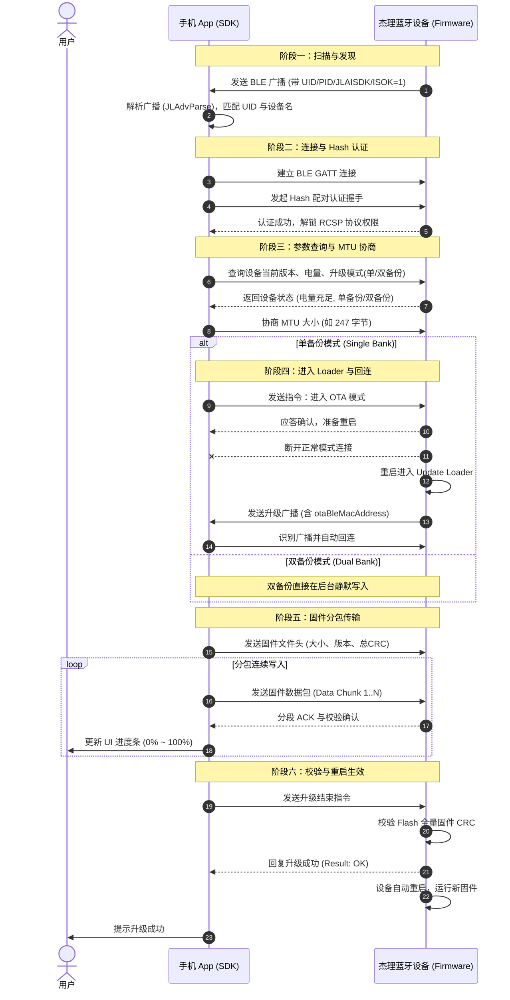

# 杰理（JieLi）芯片平台 OTA 固件升级全流程开发指南

---

## 目录
- [一、杰理官方资源与文档入口](#一杰理官方资源与文档入口)
- [二、杰理 OTA 核心架构与升级模式](#二杰理-ota-核心架构与升级模式)
  - [2.1 单备份升级（Single Bank / Loader 模式）](#21-单备份升级single-bank--loader-模式)
  - [2.2 双备份升级（Dual Bank / 无感后台升级）](#22-双备份升级dual-bank--无感后台升级)
  - [2.3 单/双备份特性对比](#23-单双备份特性对比)
- [三、杰理 BLE 广播数据（AdvData）深度解析](#三杰理-ble-广播数据advdata深度解析)
  - [3.1 广播包基础与厂商自定义数据（0xFF）](#31-广播包基础与厂商自定义数据0xff)
  - [3.2 SDK 广播解析字段字典详解](#32-sdk-广播解析字段字典详解)
  - [3.3 原始广播十六进制数据拆解实战](#33-原始广播十六进制数据拆解实战)
  - [3.4 设备类型枚举（JL_DeviceType）](#34-设备类型枚举jl_devicetype)
- [四、杰理 OTA 全生命周期交互时序与流程](#四杰理-ota-全生命周期交互时序与流程)
  - [4.1 阶段一：设备发现与广播过滤（Discovery & Filtering）](#41-阶段一设备发现与广播过滤discovery--filtering)
  - [4.2 阶段二：建立连接与 Hash 配对认证（Connect & Auth）](#42-阶段二建立连接与-hash-配对认证connect--auth)
  - [4.3 阶段三：OTA 参数查询与协商（Inquiry & MTU）](#43-阶段三ota-参数查询与协商inquiry--mtu)
  - [4.4 阶段四：准备进入升级模式与回连机制（Prepare & Reconnect）](#44-阶段四准备进入升级模式与回连机制prepare--reconnect)
  - [4.5 阶段五：固件分包传输与校验（Data Transfer & Verify）](#45-阶段五固件分包传输与校验data-transfer--verify)
  - [4.6 阶段六：升级完成与固件生效（Finish & Reboot）](#46-阶段六升级完成与固件生效finish--reboot)
  - [4.7 升级交互时序图（Mermaid）](#47-升级交互时序图mermaid)
- [五、异常处理、断点续传与强制升级](#五异常处理断点续传与强制升级)
  - [5.1 断点续传机制](#51-断点续传机制)
  - [5.2 强制升级（Force OTA / 救砖）](#52-强制升级force-ota--救砖)
  - [5.3 常见错误码及排查方向](#53-常见错误码及排查方向)
  - [5.4 典型实战案例：绳师升级失败与 Bootloader 恢复模式广播异常](#54-典型实战案例绳师funf升级失败与-bootloader-恢复模式广播异常)
  - [5.5 跨品类固件误刷漏洞：男用设备可刷入女用固件问题](#55-跨品类固件误刷漏洞男用设备可刷入女用固件问题)
- [六、OTA 阶段拆解：「校验文件」到底在校验什么？](#六ota-阶段拆解校验文件到底在校验什么)
  - [6.1 「校验文件」的 5 大核心校验维度](#61-校验文件的-5-大核心校验维度)
- [七、源码与底层证据链索引（Code Evidence）](#七源码与底层证据链索引code-evidence)
- [八、杰理 OTA 实测记录与基准总表（Test Logs & Benchmark）](#八杰理-ota-实测记录与基准总表test-logs--benchmark)
  - [8.1 产品「绳师 (funf)」- 男用单备份 实测记录（#1 ~ #11）](#81-产品绳师-funf---男用单备份-实测记录1--11)
  - [8.2 绳师产品 OTA 升级问题汇总](#82-绳师产品-ota-升级问题汇总)
  - [8.3 产品「G1 (MonsterHub)」- 男用双备份 实测记录（#1 ~ #5）](#83-产品g1-monsterhub---男用双备份-实测记录1--5)
  - [8.4 单备份 vs 双备份 耗时与容灾对比矩阵](#84-单备份-vs-双备份-耗时与容灾对比矩阵)

---

## 一、杰理官方资源与文档入口

| 平台 / 资源 | 验证状态 | 地址 / 链接 | 说明 |
| :--- | :---: | :--- | :--- |
| **杰理科技官网** | ✅ 正常 | [https://www.zh-jieli.com/](https://www.zh-jieli.com/) | 珠海市杰理科技股份有限公司官方门户 |
| **杰理官方文档系统** | ✅ 正常 | [https://doc.zh-jieli.com/](https://doc.zh-jieli.com/) | 官方在线文档系统（含各类芯片 SDK、RCSP 与 OTA 开发指南） |
| **Gitee 官方开源主页** | ✅ 正常 | [https://gitee.com/Jieli-Tech](https://gitee.com/Jieli-Tech) | 包含官方维护的各类开源项目 |
| **iOS OTA 官方仓库** | ✅ 正常 | [Gitee](https://gitee.com/Jieli-Tech/iOS-JL_OTA) / [GitHub](https://github.com/Jieli-Tech/iOS-JL_OTA) | 杰理 iOS 平台 OTA 升级 SDK 与 Demo |
| **Android OTA 官方仓库**| ✅ 正常 | [Gitee](https://gitee.com/Jieli-Tech/Android-JL_OTA) / [GitHub](https://github.com/Jieli-Tech/Android-JL_OTA) | 杰理 Android 平台 OTA 升级 SDK 与 Demo |
| **Flutter OTA 官方插件** | ✅ 正常 | [Gitee](https://gitee.com/Jieli-Tech/JL_OTA_Flutter) / [GitHub](https://github.com/Jieli-Tech/JL_OTA_Flutter) | 跨平台 Flutter OTA 插件与示例工程 |
| **微信小程序 OTA 仓库** | ✅ 正常 | [https://gitee.com/Jieli-Tech/WeChat-Mini-Program-OTA](https://gitee.com/Jieli-Tech/WeChat-Mini-Program-OTA) | 杰理微信小程序 OTA 升级方案 |

---

## 二、杰理 OTA 核心架构与升级模式

杰理芯片（如 AC690N、AC692N、AC695N、AC696N、AC701N、AC632N、JL701N 等）在固件设计上主要支持两种 OTA 升级架构：

```
                    ┌─────────────────────────┐
                    │    杰理 OTA 固件架构     │
                    └────────────┬────────────┘
                                 │
                 ┌───────────────┴───────────────┐
                 ▼                               ▼
      ┌─────────────────────┐         ┌─────────────────────┐
      │  单备份 (Single Bank) │         │  双备份 (Dual Bank)  │
      │  (需加载 Loader 重启) │         │  (后台无感静默写入)   │
      └─────────────────────┘         └─────────────────────┘
```

### 2.1 单备份升级（Single Bank / Loader 模式）
*   **适用场景**：Flash 存储空间较小（如 4Mbit / 512KB、8Mbit / 1MB）的经济型芯片。
*   **升级包文件**：通常为 `ota.bin`（内置 Update Loader）。
*   **运行原理**：
    1. 升级开始时，App 将升级用的 Loader 传输并写入芯片 VM 存储区；
    2. 设备自动重启并跳转至 RAM 或 Loader 区域运行；
    3. 设备发出专用的 OTA 升级广播（通常包含 `JLOTA` 标识或特殊广播包）；
    4. 手机 App 扫描到该广播后自动**重连（Reconnect）**设备；
    5. App 继续将真正的 App Code 固件数据直接写入 Flash 代码区覆盖旧代码；
    6. 写入校验通过后，设备重启进入新固件。
*   **特点**：极度节省 Flash 空间；但升级期间设备会断开重连，若写入中途中断可能会停留在 Loader 模式（需触发强制升级恢复）。

### 2.2 双备份升级（Dual Bank / 无感后台升级）
*   **适用场景**：Flash 空间充裕（通常 ≥ 16Mbit / 2MB）的高端音频/手表/通用 SoC。
*   **升级包文件**：通常为 `db_update_data.bin`。
*   **运行原理**：
    1. Flash 划分为两块对称或独立的程序区（Bank A 和 Bank B）；
    2. 当前在 Bank A 正常运行，App 直接在后台将新固件静默写入处于闲置状态的 Bank B；
    3. 传输过程中设备**不需要重启或断开蓝牙**，业务功能可正常保持；
    4. 写入完毕并进行完整性校验（Hash/CRC）无误后，App 发送重启生效指令；
    5. 设备重启，Bootloader 切换执行指针指向 Bank B，完成秒级生效。
*   **特点**：极高安全性（升级中途中断完全不影响原固件运行，绝不“变砖”），无需回连。

### 2.3 单/双备份特性对比

| 特性维度 | 单备份 (Single Bank) | 双备份 (Dual Bank) |
| :--- | :--- | :--- |
| **Flash 空间开销** | 极低（仅需少量 VM 空间存放 Loader） | 较高（需预留 2 倍 App 固件空间） |
| **升级包格式** | `ota.bin` | `db_update_data.bin` |
| **升级过程体验** | 需重启并断连，App 需回连升级广播 | 全程在线无感传输，无需断连回连 |
| **升级中断风险** | 需进入 Loader 恢复 / 强制升级 | 原固件完好无损，直接重新触发即可 |
| **固件互转** | 单双备份配置由固件编译和 Flash 布局决定，OTA 无法跨架构转换 |

---

## 三、杰理 BLE 广播数据（AdvData）深度解析

### 3.1 广播包基础与厂商自定义数据（0xFF）
杰理设备的 BLE 广播数据遵循标准 BLE 规范，由多个 AD Structure 组成。其中核心的设备标识、电量、状态及 OTA 回连信息主要封装在 **AD Type = `0xFF`（Manufacturer Specific Data / 厂商自定义数据）** 段中。
*   **杰理 SIG 厂商 ID（Vendor ID）**：`0x05D6`（十六进制小端字节序：`D6 05`，代表 *Zhuhai Jieli Technology Co.,Ltd*）。

### 3.2 SDK 广播解析字段字典详解

在 iOS 端调用 `[JLAdvParse bluetoothAdvParse:AdvData:]` 或 Android/Flutter 端解析广播包时，会生成如下字典结构：

```json
{
    "ADVDATA": "122502009900ec00a600fc00d60508004a4c414953444b",
    "BLE_NAME": "funf",
    "EDR": "",
    "ISBOUND": 0,
    "ISCHARGING": 0,
    "ISLINKED": 0,
    "ISOK": 1,
    "PID": "",
    "POWER": 0,
    "TYPE": "-1",
    "UID": 2512
}
```

| 字段名称 | 类型 | 取值示例 | 详细定义与业务作用 |
| :--- | :--- | :--- | :--- |
| **`ADVDATA`** | `HexString` | `12250200...` | **原始广播自定义数据**：从广播包中提取的 Manufacturer Data 十六进制字符串。 |
| **`BLE_NAME`** | `String` | `"funf"` | **低功耗蓝牙名称（Local Name）**：向外广播的设备名，用于列表展示与设备筛选。 |
| **`EDR`** | `String` | `""` 或 `"11:22:33:44:55:66"` | **经典蓝牙 MAC 地址**：杰理双模设备在 BLE 广播中携带的经典蓝牙地址，用于 App 触发静默配对。为空表示纯 BLE 或未配置 EDR 广播。 |
| **`ISBOUND`** | `Int/Bool` | `0 / 1` | **绑定配对状态**：`0` 未绑定，`1` 已绑定。配合杰理防蹭听/私有绑定认证协议。 |
| **`ISCHARGING`** | `Int/Bool` | `0 / 1` | **充电状态**：`0` 未充电，`1` 充电中。主要在耳机/充电仓/手环产品中指示电量状态。 |
| **`ISLINKED`** | `Int/Bool` | `0 / 1` | **经典蓝牙连接状态**：`0` 经典蓝牙未连，`1` 经典蓝牙已与手机建立 A2DP/HFP 链路。 |
| **`ISOK`** | `Int/Bool` | `0 / 1` | **数据合法与完整性校验**：<br>• `0`: 广播数据分包未全或未通过杰理私有协议校验；<br>• `1`: 广播数据完整且符合杰理协议规范。 |
| **`PID`** | `String/Int` | `""` 或 `1001` | **产品 ID（Product ID）**：标识具体产品型号，App 据此匹配对应的 UI 资源和固件文件。 |
| **`POWER`** | `Int` | `0 ~ 100` | **电池电量百分比**：当前设备剩余电量（0 表示未上报或使用外接电源）。 |
| **`TYPE`** | `String/Int` | `"-1"` | **设备形态类型**：对应 `JL_DeviceType` 枚举，`"-1"` 表示传统/通用透传/通用 OTA 设备。 |
| **`UID`** | `Int` | `2512` | **客户厂商唯一标识（User ID / Vendor ID）**：杰理分配给客户的专属厂商代码，用于防止误刷其他厂商设备。 |

### 3.3 原始广播十六进制数据拆解实战

以扫描到的广播数据 `122502009900ec00a600fc00d60508004a4c414953444b` 为例：

```
 12 25 │ 02 00 │ 99 00 ec 00 a6 00 fc 00 │ d6 05 │ 08 00 │ 4a 4c 41 49 53 44 4b
───────┼───────┼─────────────────────────┼───────┼───────┼───────────────────────
  UID  │ 版本/ │     设备自定义业务数据     │ 厂商ID │ 长度  │   ASCII: "JLAISDK"
 (2512)│  PID  │                         │(0x05D6)│       │   (杰理协议专属标识)
```

1. **`12 25`**：即 UID = 2512（0x2512 编码），用于识别品牌厂商。
2. **`d6 05`**：SIG 分配的杰理厂商代码 `0x05D6`。
3. **`4a 4c 41 49 53 44 4b`**：转换为 ASCII 字符串为 **`JLAISDK`**。
   - **为何数据 1 `ISOK = 0`？** 因为广播分包或只有前半段 `122502009900ec00a600fc00`，缺少了末尾的 `0x05D6` 和 `JLAISDK` 校验标记。
   - **为何数据 2 `ISOK = 1`？** 接收到了完整的带厂商信息和 `JLAISDK` 的完整包，解析库校验通过。

### 3.4 设备类型枚举（JL_DeviceType）

| 枚举值 | 标识名 | 设备类别 |
| :---: | :--- | :--- |
| **`-1`** | `JL_DeviceTypeTradition` | **传统设备 / 通用透传设备 / 通用 OTA 设备** |
| **`0`** | `JL_DeviceTypeSoundBox` | AI 音箱 |
| **`1`** | `JL_DeviceTypeChargingBin` | 智能充电仓 |
| **`2`** | `JL_DeviceTypeTWS` | TWS 双耳耳机 |
| **`3`** | `JL_DeviceTypeHeadset` | 普通单/双耳耳机、颈挂耳机 |
| **`4`** | `JL_DeviceTypeSoundCard` | 直播声卡设备 |
| **`5`** | `JL_DeviceTypeWatch` | 智能手表 / 手环设备 |

---

## 四、杰理 OTA 全生命周期交互时序与流程

杰理 OTA 的交互过程主要分为以下六个阶段：

```
[1. 扫描与过滤] ──> [2. 连接与认证] ──> [3. 参数查询/MTU] ──> [4. 准备与回连] ──> [5. 分包传输] ──> [6. 校验生效]
```

### 4.1 阶段一：设备发现与广播过滤（Discovery & Filtering）
1. 手机端开启 BLE 扫描；
2. 捕获广播包并调用 `[JLAdvParse bluetoothAdvParse:AdvData:]` 解析；
3. 检查 `ISOK == 1` 且 `UID`（或设备名 `BLE_NAME`）与目标一致；
4. 确认设备后停止扫描，准备发起连接。

### 4.2 阶段二：建立连接与 Hash 配对认证（Connect & Auth）
1. 建立 GATT 连接并发现杰理私有通讯服务与特征（如 RCSP 读写/Notify 通道）；
2. **重要安全步骤**：执行 **Hash 配对认证（Hash Auth）**。
   - App 与固件通过私有密钥算法生成随机挑战码与 Hash 签名；
   - 校验通过后，固件才允许解锁 RCSP 敏感指令及 OTA 升级权限。

### 4.3 阶段三：OTA 参数查询与协商（Inquiry & MTU）
1. **查询设备信息**：App 发送指令获取固件当前版本号、芯片架构、当前电量（通常要求电量 ≥ 20%~30% 防止断电）；
2. **查询升级模式**：获取当前固件支持的是**单备份**还是**双备份**；
3. **协商 MTU 与传输分包大小**：
   - 触发 BLE MTU 协商（如申请 MTU = 247 或 512）；
   - 根据协商结果设定每一包数据块（Block Size）的最佳长度以达到最高吞吐率。

### 4.4 阶段四：准备进入升级模式与回连机制（Prepare & Reconnect）
*   **如果是双备份（Dual Bank）**：直接跳转至阶段五，无需重启回连。
*   **如果是单备份（Single Bank）**：
    1. App 下发“进入升级模式”指令；
    2. 设备将 Loader 加载后主动断开当前蓝牙连接并重启；
    3. 设备以 OTA 模式广播（广播 Manufacturer Data 中携带原设备的 MAC 地址或带 `JLOTA` 标记）；
    4. App 端检测到蓝牙断开后，开启后台扫描，并通过 `[JLAdvParse otaBleMacAddress:isEqualToCBAdvDataManufacturerData:]` 匹配目标设备；
    5. App 快速重连（Reconnect）升级设备并重新建立数据通道。

### 4.5 阶段五：固件分包传输与校验（Data Transfer & Verify）
1. **下发文件头信息（Firmware Header）**：向设备发送固件总大小、CRC32 / MD5 校验和、版本信息；
2. **分块传输（Block Transmission）**：
   - App 按设定分包连续写入数据（支持 Write With Response 或 Write Without Response 流水线传输）；
   - 设备定期回复 ACK / 校验响应；
   - App 计算并向 UI 抛出当前升级进度百分比（Progress: 0% ~ 100%）。

### 4.6 阶段六：升级完成与固件生效（Finish & Reboot）
1. 固件全量数据发送完毕；
2. App 发送“传输完成与校验确认”指令；
3. 设备内部对写入的 Flash 数据做整体验证（CRC/Hash 校验）；
4. 设备回复升级成功响应并触发系统软复位（Reboot）；
5. 设备加载并运行全新固件版本，OTA 全流程完成。

---

### 4.7 升级交互时序图（Mermaid）



---

## 五、异常处理、断点续传与强制升级

### 5.1 断点续传机制
*   杰理 OTA 协议支持断点续传功能：
*   在传输过程中如果因信号不佳导致蓝牙异常断开，重新连接后，App 向设备查询当前已成功写入的偏移量（Offset），App 可直接从该 Offset 继续发送后续固件数据，避免从头重传。

### 5.2 强制升级（Force OTA / 救砖）
*   **触发场景**：设备升级单备份过程中被拔出电池、强行断电，导致原 App Code 已被部分擦除，开机直接停留在 Loader 模式（或者无法开机运行主程序）。
*   **处理流程**：
    1. 此时设备会持续发出专用的 Loader 修复广播（广播名通常包含 `OTA` / `JLOTA` / `OTA_XXXX`）；
    2. SDK 提供了强制升级 API（`NormalUpdate` / `ForceUpdate`）；
    3. App 扫描到带有强制升级标记的设备后，直接发起连接并重发完整固件进行覆盖修复。

### 5.3 常见错误码及排查方向

| 错误码 / 现象 | 产生原因 | 排查与解决对策 |
| :--- | :--- | :--- |
| **`0x4003` (CRC 错误)** | 固件分包或整体校验失败 | 检查升级文件是否匹配、检查蓝牙通信是否有丢包、尝试降低单包大小。 |
| **`0x4001` / 电量不足** | 设备电量低于阈值（如 < 30%） | 提示用户连接充电器或电量充足后再试。 |
| **回连超时（Timeout）** | 单备份重启后未在规定时间内扫描到回连广播 | 检查广播过滤逻辑，确认 `otaBleMacAddress` 对比方法是否正确调用。 |
| **Hash 认证失败** | 配对密钥不匹配或未经过认证 | 确认 App 端使用的 Pair Key 是否与固件端配置的秘钥一致。 |
| **广播解析 `ISOK = 0`** | 广播数据不完整 | 检查设备端广播包长度设置，确保未超过 31 字节上限或正确配置分包。 |

---

### 5.4 典型实战案例：绳师（funf）升级失败与 Bootloader 恢复模式广播异常

在实际调试中，绳师（`funf`）产品升级失败后出现了一种典型的“假死/恢复模式”状态，现象与数据如下：

#### 1. 问题现象
- **硬件表现**：产品指示灯不亮，按键无主程序响应；
- **蓝牙表现**：手机仍能正常扫描到设备（Name 依然为 `funf`），且**能够成功建立蓝牙连接**；
- **数据异常**：广播厂商数据发生改变，导致 `mix_device` 的自定义厂商模型解析返回 `null`。

#### 2. 现场证据固定（原始日志）

```log
[JL_OTA] 【1. 扫描设备】Name: funf | Desc: rssi: -64, address: 55181F07-AD88-247F-C5B2-6E3E9DB6646C | ManufacturerData: afe36a60c859004a4c4f544105d6 | AdvData: JlAdvData(manufacturerData: afe36a60c859004a4c4f544105d6, mixManufacture: null, uid: 0, pid: null, type: -1, isOk: true, isBound: true, isCharging: false, isLinked: false, power: 0, edr: null, bleName: funf)
```

#### 3. 广播数据深度对比与根因剖析

| 状态 | 厂商数据 Hex | 字段结构拆解 | 解析结果 |
| :--- | :--- | :--- | :--- |
| **正常工作模式** | `122502009900ec00a600fc00d60508004a4c414953444b` | `12 25` (UID: 2512) + `02 00` (版本) + `99 00 ec 00 ...` (PID/VID) + `d6 05` (杰理ID) + `JLAISDK` | `mixManufacture` 正常解析，UID: 2512 |
| **升级失败恢复模式** | `afe36a60c859004a4c4f544105d6` | `af e3 6a 60 c8 59` (6字节MAC/标识) + `00` + **`4a 4c 4f 54 41` ("JLOTA")** + `05 d6` (杰理ID) | `mixManufacture` 为 `null`，UID: 0 |

**根因剖析**：
1. **芯片退回 Bootloader 恢复区**：单备份固件写入中断后，主程序损坏，芯片自动运行 Bootloader（升级 Loader）代码；
2. **广播格式被底层接管**：Loader 广播使用的是杰理原生标准 OTA 恢复格式，包含 **`JLOTA`**（`4A 4C 4F 54 41`）签名，而不再携带 mix 业务层的 23 字节自定义 PID/VID 结构；
3. **因此 `mixManufacture` 解析为 `null` 是符合芯片底层机制的预期现象**。

#### 4. 解决对策与实测验证（救砖与断点续传）
- **无需硬件返厂**：只要蓝牙能搜到并能连上，说明 Bootloader 完好；
- **基于失败后继续扫描连接升级**：保持在当前 App 中重新搜索设备并连接，再次选择 `man_02.ufw` 点击升级；
- **升级阶段机制差异**：
  - **正常模式升级（两阶段）**：包含【阶段一：校验文件】（比对固件头信息、分配空间、设备重启）与【阶段二：真正升级】（分包写入 Flash）；
  - **恢复模式救砖（直接进入升级）**：由于设备已在 Loader 模式且前次已完成文件头认证，**直接跳过了「校验文件」阶段，直接进入「真正升级」阶段**，并从中断 Offset 继续写入；
- **实测验证结果**：
  - 触发了杰理底层**断点续传**机制，重刷全量 1.22 MB 固件**仅耗时 16 秒**（正常完整包含两阶段需 40s 左右）；
  - 固件烧录成功重启后，设备指示灯恢复正常点亮，广播数据恢复为正常 mix 协议格式，完美救砖。

---

### 5.5 跨品类固件误刷漏洞：男用设备可刷入女用固件问题

在实战测试中（见测试记录 #8），发现了一项重大产品逻辑与升级安全问题：**男用设备（绳师）成功刷入了女用产品固件（`woman_01.ufw`），并在重启后身份彻底变更为女用设备**。

#### 1. 问题现象与现场还原
- **原始状态**：设备为男用产品 绳师（`funf`，广播中 PID: 153, VID: 236, connApp: 0）；
- **操作过程**：在 App 固件列表中选中女用固件 `woman_01.ufw` 并发起 OTA 升级；
- **升级结果**：杰理底层顺利通过文件校验并完成 49 秒烧录，提示**升级成功**；
- **异常表现**：设备重启后，广播包中的产品型号直接变更为女用（PID 由 153 变更为 152），App 再次连接后完全识别并显示为女用设备。

#### 2. 升级前后现场广播铁证对比

```log
// 【升级前】男用产品 绳师（PID: 153, 0x0099）
[JL_OTA] 【1. 扫描设备】Name: funf | ManufacturerData: 122502009900ec00a600fc00d60508004a4c414953444b | AdvData: JlAdvData(mixManufacture: JlMixManufacture(v: 2, app: 0, pid: 153, vid: 236, hid: 0, g_pid: 166, g_vid: 252))

// 【升级后】设备身份彻底变为女用产品（PID: 152, 0x0098）
[JL_OTA] 【1. 扫描设备】Name: funf | Desc: rssi: -49, address: 5B3CBF98-F618-0D19-C99E-5BE597EAA953 | ManufacturerData: 122502009800ec00a600fc00d60508004a4c414953444b | AdvData: JlAdvData(manufacturerData: 122502009800ec00a600fc00d60508004a4c414953444b, mixManufacture: JlMixManufacture(v: 2, app: 0, pid: 152, vid: 236, hid: 0, g_pid: 166, g_vid: 252), uid: 2512, pid: null, type: -1, isOk: true, isBound: false, isCharging: false, isLinked: false, power: 0, edr: null, bleName: funf)
```

| 状态 | 厂商数据 Hex | PID 字节与对应数值 | 设备属性 |
| :--- | :--- | :--- | :--- |
| **升级前（原机）** | `12250200 9900 ec00 ...` | `99 00` (小端 `0x0099` = **153**) | **男用产品（绳师）** |
| **升级后（刷入女用固件）** | `12250200 9800 ec00 ...` | `98 00` (小端 `0x0098` = **152**) | **女用产品** |

---

## 六、OTA 阶段拆解：「校验文件」到底在校验什么？

在杰理官方 OTA 交互协议中，升级过程严格区分为 **阶段一：校验文件（Preparing / Checking File）** 与 **阶段二：真正升级（Upgrading / Data Flashing）**。

### 6.1 「校验文件」的 5 大核心校验维度

```text
                  App 发送固件头信息 (Header Info)
  ┌───────────────────────────────────────────────────────────────┐
  │  1. 固件魔数 (Magic)  │ 2. 芯片型号 (Chip) │ 3. PID & VID     │
  │  4. 固件大小 (Size)   │ 5. 全局 CRC32      │ 6. 目标版本号     │
  └───────────────────────────────────────────────────────────────┘
                                 │
                                 ▼ 设备底层逐项比对
```

1. **芯片架构与硬件型号校验（Chip Architecture）**：
   - 检查固件编译的目标芯片（如 AC695N、AC696N、AC701N、JL7016 等）是否与当前物理芯片一致；
   - **作用**：防止将不匹配芯片的固件写入，导致硬件彻底烧毁或死砖。
2. **客户厂商 UID 与产品 PID/VID 匹配（Product & Vendor Matching）**：
   - 检查固件内的厂商识别码（如 `UID: 2512`）与产品型号 `PID/VID` 是否与当前设备一致；
   - **作用**：防止同芯片平台下的其他产品固件误刷入。
3. **固件完整性与全局 CRC32 校验（File Integrity & Global CRC32）**：
   - App 会发送固件的**文件总长度（File Size）**与**全量 CRC32 校验和**；
   - **作用**：确保固件在网络下载或手机存储中无任何字节损坏、缺失或篡改。
4. **Flash 分区空间与单/双备份模式匹配（Flash Space & Bank Mode）**：
   - 设备比对固件体积是否小于 Flash 中分配的 OTA 写入扇区上限；
   - **作用**：确认 Flash 空间充足，并在单备份模式下通知芯片重启进入 Update Loader。
5. **版本号与防降级策略（Firmware Version & Anti-Rollback）**：
   - 读取目标固件版本号与当前运行版本对比；
   - **作用**：根据固件端策略决定是否允许同版本覆盖、跨版本升级或拦截非法降级。

---

## 七、源码与底层证据链索引（Code Evidence）

以下为本项目（App 客户端）、杰理官方 SDK 及服务端（`server-rs`）中支持上述机制的源码与数据字典实现位置：

| 平台 / 模块 | 源码文件链接 | 对应行号 | 核心证据与实现内容 |
| :--- | :--- | :--- | :--- |
| **App 协议解析** | [jl_adv_data.dart](file:///Volumes/T9/work/jl_ota/lib/model/jl_adv_data.dart#L152-L298) | L152-L298 | mix_device 厂商广播解析：小端序提取 `productID`、`variantID`、`connApp`、`groupProductID`。 |
| **App 升级控制** | [update_page.dart](file:///Volumes/T9/work/jl_ota/example/lib/pages/update_page.dart#L231-L311) | L231-L311 | OTA 触发入口、固件选择过滤与升级前品类拦截检测（`_handleStartOta`、`_startOTA`）。 |
| **App 表现层** | [ota_dialog.dart](file:///Volumes/T9/work/jl_ota/example/lib/dialog/ota_dialog.dart#L150-L165) | L150-L165 | 监听 `BleEventConstants.KEY_CHECK_FILE` 显示“校验文件中”，收到升级事件切换为“升级中”与进度条。 |
| **App 多语言** | [app_zh.arb](file:///Volumes/T9/work/jl_ota/example/lib/l10n/app_zh.arb#L296-L297) | L296-L297 | `otaCheckFile`: "校验文件中", `otaUpgrading`: "升级中"。 |
| **iOS 原生层** | [OtaManager.swift](file:///Volumes/T9/work/jl_ota/ios/Classes/Ota/OtaManager.swift#L272-L295) | L272-L295 | `JL_OTAResult.preparing` 映射为 `MSG_CHECKING_FILE` ("Checking file")，`JL_OTAResult.upgrading` 映射为 `MSG_UPGRADING`。 |
| **iOS 蓝牙层** | [JLBleManager.m](file:///Volumes/T9/work/jl_ota/ios/Classes/BleManager/JLBleManager.m#L202-L207) | L202-L207 | 广播回调中从 `kCBAdvDataManufacturerData` 提取 0xFF 厂商数据作为 `ADVDATA`。 |
| **Android 原生层** | [EventChannelConstants.kt](file:///Volumes/T9/work/jl_ota/android/src/main/kotlin/com/jieli/otasdk/data/constant/EventChannelConstants.kt#L55-L60) | L55-L60 | 定义 `MSG_CHECKING_FILE = "Checking file"` 与 `MSG_UPGRADING = "Upgrading"` 状态常量。 |
| **服务端领域模型** | [device.rs](file:///Users/waitwalker/Downloads/server-rs/gateway/remote-gateway/src/domain/session/user/device.rs#L7-L17) | L7-L17 | `server-rs` 定义 `Device` 结构体：`product_id`、`variant_id`、`group_product_id` 领域模型。 |
| **服务端通信协议** | [model.proto](file:///Users/waitwalker/Downloads/server-rs/gateway/remote-gateway/proto/remote/v1/model.proto#L7-L24) | L7-L24 | `server-rs` 定义 `RemoteDevice` Protobuf 协议：`product_id`、`variant_id`、`group_product_id`。 |
| **服务端固件管理表** | [op_admin--2026-3-2.sql](file:///Users/waitwalker/Downloads/server-rs/docs/legacy_database/op_admin--2026-3-2.sql#L856-L876) | L856-L876 | `os_product_firmware` 运营后台固件分发与灰度策略表（绑定 `product_id` 与固件版本）。 |
| **服务端固件关系表** | [monsterpub_base--2026-3-2.sql](file:///Users/waitwalker/Downloads/server-rs/docs/legacy_database/monsterpub_base--2026-3-2.sql#L467-L500) | L467-L500 | `common_app_firmware` / `common_app_firmware_relation` 固件与 App 版本关系表。 |
| **服务端固件信息表** | [monsterpub--2026-3-2.sql](file:///Users/waitwalker/Downloads/server-rs/docs/legacy_database/monsterpub--2026-3-2.sql#L1084-L1097) | L1084-L1097 | `firmware_infos` 硬件型号与固件下载链接关联表。 |
| **测试记录文档** | [JIELI_OTA_TEST_LOG.md](file:///Volumes/T9/work/jl_ota/JIELI_OTA_TEST_LOG.md#L83-L96) | L83-L96 | 详细记录第 6 次升级跳过校验文件、仅耗时 16s 完成断点续传救砖的真实测试数据。 |

---

## 八、杰理 OTA 实测记录与基准总表（Test Logs & Benchmark）

本文档收录了在真实真机环境下（iOS 与 Android 双端）对杰理不同固件架构（单备份 vs 双备份）、不同硬件产品（绳师 vs G1）进行的全部联调与压测数据。

---

### 8.1 产品「绳师 (funf)」- 男用单备份 实测记录（#1 ~ #11）

> **架构特点**：采用**单备份（Single Bank）**升级方案。升级开始后设备重启至 Bootloader/Loader 擦写 Flash；若中途断电或中断，设备进入 Bootloader 恢复广播（灯灭，`JLOTA` 签名），重连后可断点续传救砖。

#### 📊 绳师测试总表

| 序号 | 原产品 | 男用/女用 | 备份模式 | OTA 固件 | 文件大小 | 手机平台 | OTA 开始时间 (Start) | OTA 结束时间 (End) | 总耗时 | 升级状态 | 关键现象与测试备注 |
| :---: | :---: | :---: | :---: | :---: | :---: | :---: | :---: | :---: | :---: | :---: | :---: |
| **1** | 绳师 (funf) | 男用 | 单备份 | `man_02.ufw` | 1247.8 KB (1.22 MB) | **iOS** | 2026-08-24 12:03:14 | 2026-08-24 12:03:55 | **41s** | ✅ 升级成功 | 正常模式首次升级（含文件校验 + 真正升级两阶段） |
| **2** | 绳师 (funf) | 男用 | 单备份 | `man_01.ufw` | 1247.3 KB (1.22 MB) | **iOS** | 2026-08-24 12:15:27 | 2026-08-24 12:16:07 | **40s** | ✅ 升级成功 | 正常模式覆盖升级（含文件校验 + 真正升级两阶段） |
| **3** | 绳师 (funf) | 男用 | 单备份 | `man_02.ufw` | 1247.8 KB (1.22 MB) | **iOS** | 2026-08-24 12:17:03 | 2026-08-24 12:17:43 | **40s** | ✅ 升级成功 | 正常模式覆盖升级（含文件校验 + 真正升级两阶段） |
| **4** | 绳师 (funf) | 男用 | 单备份 | `man_01.ufw` | 1247.3 KB (1.22 MB) | **iOS** | 2026-08-24 12:19:04 | 2026-08-24 12:19:45 | **40s** | ✅ 升级成功 | 正常模式覆盖升级（含文件校验 + 真正升级两阶段） |
| **5** | 绳师 (funf) | 男用 | 单备份 | `man_02.ufw` | 1247.8 KB (1.22 MB) | **iOS** | 2026-08-24 12:20:22 | 2026-08-24 12:20:50 | **27s** | ❌ 升级失败 | 写入 27s 时异常中断，设备进入 Bootloader 恢复模式，灯熄灭 |
| **6** | 绳师 (funf) | 男用 | 单备份 | `man_02.ufw` | 1247.8 KB (1.22 MB) | **iOS** | 2026-08-24 12:26:54 | 2026-08-24 12:27:10 | **16s** | ✅ 救砖/续传成功 | **基于第5次失败后继续扫描连接升级**：硬件灯不亮、但可搜可连；**跳过文件校验直接真正升级**，仅耗时16s完成续传，恢复后正常亮灯 |
| **7** | 绳师 (funf) | 男用 | 单备份 | `man_01.ufw` | 1247.3 KB (1.22 MB) | **iOS** | 2026-08-24 12:33:03 | 2026-08-24 12:33:45 | **41s** | ✅ 升级成功 | 正常模式覆盖升级（含文件校验 + 真正升级两阶段） |
| **8** | 绳师 (funf) | **男用 ➔ 女用** | 单备份 | `woman_01.ufw` | 1234.3 KB (1.21 MB) | **iOS** | 2026-08-24 12:38:33 | 2026-08-24 12:39:22 | **49s** | ⚠️ **跨品类刷新成功** | **重大发现：男用产品成功刷入女用固件**，重启后广播 PID 变为 152（女用），App 连接后识别显示为女用 |
| **9** | 绳师 (已变女用) | **女用 ➔ 男用** | 单备份 | `man_02.ufw` | 1247.8 KB (1.22 MB) | **iOS** | 2026-08-24 12:47:23 | 2026-08-24 12:48:06 | **43s** | ✅ **逆向刷回成功** | **将女用状态设备成功刷回男用固件**，耗时 43s，成功恢复男用产品身份 |
| **10** | 绳师 (funf) | 男用 | 单备份 | `man_02.ufw` | 1247.8 KB (1.22 MB) | **Android** | 2026-08-24 14:29:36 | 2026-08-24 14:30:17 | **41s** | ✅ **升级成功** | **Android 平台首测成功**：TLV 厂商数据提取修复后，广播与 `mixManufacture (PID: 153)` 完美解析，耗时 41s 顺利完成升级 |
| **11** | 绳师 (funf) | 男用 | 单备份 | `man_01.ufw` | 1247.3 KB (1.22 MB) | **Android** | 2026-08-24 14:31:41 | 2026-08-24 14:32:21 | **39s** | ✅ **升级成功** | **Android 平台覆盖升级**：`man_01.ufw` 完整两阶段升级，耗时 39s 顺利完成 |

---

### 8.2 绳师产品 OTA 升级问题汇总

1. **升级中途异常中断导致设备变砖（进入 Bootloader 恢复模式）**：
   - 固件烧录过程中断（如第 5 次升级写入 27s 时人为/意外断开），设备指示灯完全熄灭，按键无主程序响应；
   - 芯片回退至 Bootloader 模式广播，广播丢失 mix 自定义协议字段（`mixManufacture` 解析为空），无法获取原有产品 PID/VID。
2. **跨品类固件误刷漏洞（男用设备可成功刷入女用固件）**：
   - 男用产品（PID: 153）在 App 中选择女用固件（`woman_01.ufw`）发起升级，固件底层直接通过校验并完成烧录；
   - 升级完成后设备重启，广播 PID 直接变为 152（女用），App 识别并显示为女用设备。

---

### 8.3 产品「G1 (MonsterHub)」- 男用双备份 实测记录（#1 ~ #5）

> **架构特点**：采用**双备份（Dual Bank / A-B 分区）**升级方案。Flash 划分两个对称镜像区（Run 区与 Update 区）。升级过程中设备无需重启至 Loader，在主固件正常运行状态下直接后台接收固件写入 Update 区；即使升级异常中断，原 Run 区固件完好无损，设备指示灯正常，重连即可无感重试。升级全部接收且校验 CRC 成功后，仅需瞬间切换 Boot 分区重启即可生效。

#### 📊 G1 测试总表

| 序号 | 原产品 | 男用/女用 | 备份模式 | OTA 固件 | 文件大小 | 手机平台 | OTA 开始时间 (Start) | OTA 结束时间 (End) | 总耗时 | 升级状态 | 关键现象与测试备注 |
| :---: | :---: | :---: | :---: | :---: | :---: | :---: | :---: | :---: | :---: | :---: | :---: |
| **1** | G1 (MonsterHub) | 男用 | 双备份 | `G1_MonsterHub_man_6B44_106_20260331.ufw` | 627.0 KB (0.61 MB) | **Android** | 2026-08-24 14:42:30 | 2026-08-24 14:43:18 | **48s** | ✅ **升级成功** | **G1 双备份首测成功**：广播 PID: 157 (0x009D) / VID: 243 (0x00F3) 完美解析，双备份平滑烧录，耗时 48s 顺利完成 |
| **2** | G1 (MonsterHub) | 男用 | 双备份 | `G1_MonsterHub_man_E06F_107_20260401.ufw` | 627.0 KB (0.61 MB) | **Android** | 2026-08-24 14:46:00 | 2026-08-24 14:46:49 | **49s** | ✅ **升级成功** | **G1 双备份版本迭代测试 (v106 ➔ v107)**：双备份平滑烧录，耗时 49s 稳定完成 |
| **3** | G1 (MonsterHub) | 男用 | 双备份 | `G1_MonsterHub_man_6B44_106_20260331.ufw` | 627.0 KB (0.61 MB) | **Android** | 2026-08-24 14:48:56 | 2026-08-24 14:49:45 | **49s** | ✅ **升级成功** | **G1 双备份逆向/降级测试 (v107 ➔ v106)**：双备份平滑覆盖回退，耗时 49s 顺利完成 |
| **4** | G1 (MonsterHub) | 男用 | 双备份 | `G1_MonsterHub_man_E06F_107_20260401.ufw` | 627.0 KB (0.61 MB) | **Android** | 2026-08-24 14:50:41 | 2026-08-24 14:51:31 | **49s** | ✅ **升级成功** | **G1 双备份再次升至最新 (v106 ➔ v107)**：双备份平滑烧录，耗时 49s 顺利完成 |
| **5** | G1 (MonsterHub) | 男用 | 双备份 | `G1_MonsterHub_man_6B44_106_20260331.ufw` | 627.0 KB (0.61 MB) | **Android** | 2026-08-24 14:52:31 | 2026-08-24 14:52:41 | **9s** | ❌ **人为强制中断** | **双备份容灾铁证**：在 9s 强制断电关机；**重新开机后设备完好无损、无变砖、广播正常、立即重连成功**（Run 分区完全不受影响） |

---

### 8.4 单备份 vs 双备份 耗时与容灾对比矩阵

| 评估维度 | 单备份架构（绳师 / funf） | 双备份架构（G1 / MonsterHub） |
| :--- | :--- | :--- |
| **固件典型大小** | 1247 KB (1.22 MB) | 627 KB (0.61 MB) |
| **平均升级耗时** | **39s ~ 41s** | **48s ~ 49s** |
| **平均传输速率** | 约 **30.5 KB/s** | 约 **12.8 KB/s** |
| **升级过程工作状态** | 必须重启退回 Loader 擦写 Flash | **正常运行主程序，后台静默流式写入** |
| **烧录中断表现** | ❌ 主程序损坏，灯灭，退回 Bootloader | ✅ **主程序完好无损，灯效正常，无任何变砖** |
| **中断后广播表现** | 变为杰理原生 `JLOTA` 签名临时广播 | 保持原产品 `MonsterHub` 广播不变 |
| **中断恢复机制** | 需在 Loader 广播下重新连接并断点续传 | **零修复成本**，直接重新点击升级即可 |
| **Flash 硬件开销** | 仅需 1 份主固件空间，Flash 占用小 | 需划分 Run/Update 两个对称分区，Flash 开销大 |
