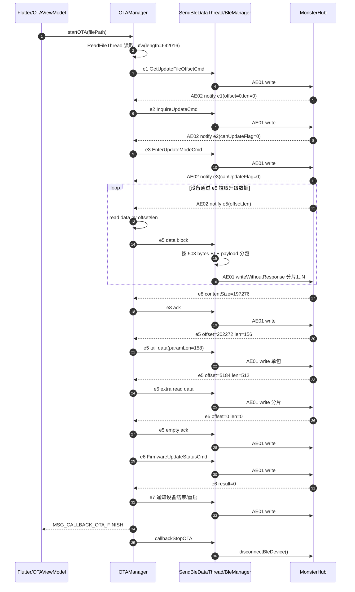
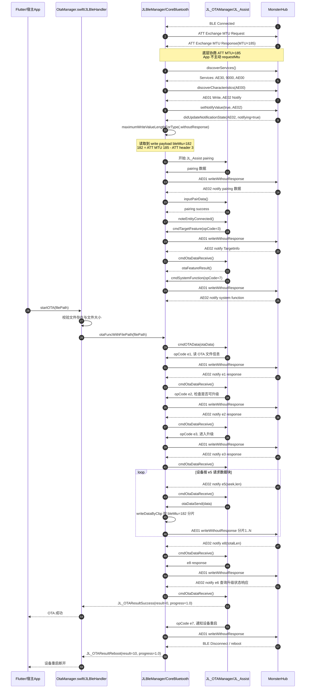

# jl_ota 插件解耦文档

## 问题背景

`jl_ota` 插件最初是从杰理 SDK 示例应用中提取的，代码直接依赖示例工程中的特定类（`MainActivity`、`MyApplication`、`FlutterViewController`）。当作为依赖集成到第三方宿主应用时，会触发 `MissingPluginException`，导致插件完全不可用。

---

## 一、Android 侧问题与修复

### 1.1 问题现象

```
MissingPluginException(No implementation found for method xxx on channel com.jieli.ble_plugin/methods)
```

### 1.2 根本原因

`JlOtaPlugin.initializeBlePlugin()` 中对 Activity 做了强制类型检查：

```kotlin
// ❌ 原代码：只有当宿主的 Activity 是杰理 SDK 示例工程中定义的 MainActivity 类时才初始化
// 这里的 MainActivity 是 jl_ota 插件 example 工程里的类（com.jieli.otasdk.MainActivity），
// 而非通用的 Activity。任何第三方宿主应用的 Activity 都不可能是这个类，因此条件永远为 false。
if (activity is MainActivity) {
    blePlugin = BlePlugin(binaryMessenger!!, activity as MainActivity)
}
```

第三方宿主应用的 Activity 不是杰理示例工程中的 `MainActivity`，条件永远为 `false`，`BlePlugin` 不会被创建，所有 MethodChannel/EventChannel 都不会注册。

此外：
- `MethodChannelHandler` 构造参数类型为 `MainActivity`，强依赖宿主类
- `MyApplication` 要求宿主 Application 必须继承它，否则 SDK 初始化失败
- 文件选择（`pickFile`）和权限请求逻辑写死在 `MainActivity` 中

### 1.3 修复方案

#### JlOtaPlugin.kt — 承接 Activity 职责

| 改动 | 说明 |
|------|------|
| 实现 `ActivityResultListener` | 接管文件选择回调，不再依赖 `MainActivity.onActivityResult` |
| 实现 `RequestPermissionsResultListener` | 接管权限请求回调，不再依赖 `MainActivity.onRequestPermissionsResult` |
| `initializeBlePlugin()` 移除类型检查 | 使用通用 `Activity` 类型，任何宿主都能初始化 |
| `onAttachedToEngine` 中调用 `MyApplication.initWith(context)` | 用宿主的 applicationContext 初始化 SDK 单例 |

```kotlin
// ✅ 修复后：不再检查 Activity 类型
private fun initializeBlePlugin() {
    val act = activity
    val messenger = binaryMessenger
    if (act != null && messenger != null) {
        blePlugin = BlePlugin(messenger, act, this)
    }
}
```

#### BlePlugin.kt — 使用通用 Activity

```diff
- class BlePlugin(messenger: BinaryMessenger, private val activity: MainActivity) {
+ class BlePlugin(messenger: BinaryMessenger, private val activity: Activity, private val plugin: JlOtaPlugin) {
```

#### MethodChannelHandler.kt — 解耦 MainActivity

```diff
- class MethodChannelHandler(private val activity: MainActivity) : MethodChannel.MethodCallHandler {
+ class MethodChannelHandler(private val activity: Activity, private val plugin: JlOtaPlugin) : MethodChannel.MethodCallHandler {
```

权限请求和文件选择改为通过 `plugin` 实例调用：

```diff
- activity.requestMissingPermissions(permissions) { granted -> ... }
+ plugin.requestMissingPermissions(permissions) { granted -> ... }

- activity.pickFile()
+ plugin.pickFile()

- MainActivity.selectedUri?.let { ... }
+ JlOtaPlugin.selectedUri?.let { ... }
```

#### MyApplication.kt — 支持外部初始化

新增静态方法 `initWith(context)`，允许在不继承 `MyApplication` 的情况下初始化 SDK 环境：

```kotlin
companion object {
    fun initWith(context: Context) {
        if (instance != null) return
        synchronized(this) {
            if (instance == null) {
                val wrapper = MyApplication()
                instance = wrapper
                wrapper.initFromContext(context.applicationContext)
            }
        }
    }
}
```

`initFromContext` 内部完成：
- `attachBaseContext` 赋予 wrapper 完整的 Context 能力
- 初始化 OTA 文件目录、日志目录
- 初始化 `ActivityManager`、`ToastUtil`、`CommonUtil` 等第三方组件

### 1.4 涉及文件

| 文件 | 改动类型 |
|------|----------|
| `android/.../JlOtaPlugin.kt` | 重构 |
| `android/.../BlePlugin.kt` | 重构 |
| `android/.../MethodChannelHandler.kt` | 重构 |
| `android/.../MyApplication.kt` | 新增 `initWith` |

### 1.5 对应 Commit

```
2de7800 refactor: 重构插件以解耦 MainActivity 和 MyApplication 依赖
```

---

## 二、iOS 侧问题与修复

### 2.1 问题现象

```
MissingPluginException(No implementation found for method listen on channel com.jieli.ble_plugin/events)
```

### 2.2 根本原因

`BlePlugin.register(with:)` 中强制要求 `rootViewController` 必须是 `FlutterViewController`：

```swift
// ❌ 原代码：强制将 rootViewController 转换为 FlutterViewController 类型
// 这在杰理 SDK 示例工程中可以正常工作，因为示例工程的 rootViewController 就是 FlutterViewController。
// 但第三方宿主应用可能使用 UINavigationController、UITabBarController 等作为 rootViewController，
// 此时 as? FlutterViewController 转换失败，整个 if 块被跳过，导致 channel 未注册。
if let window = UIApplication.shared.delegate?.window,
   let flutterViewController = window?.rootViewController as? FlutterViewController {

    instance.eventChannelHandler = EventChannelHandler(flutterViewController: flutterViewController)
    instance.methodChannelHandler = MethodChannelHandler(
        flutterViewController: flutterViewController,
        eventChannelHandler: instance.eventChannelHandler
    )

    instance.methodChannel?.setMethodCallHandler(...)
    instance.eventChannel?.setStreamHandler(...)  // ← 只在这里注册
}
```

当第三方宿主应用使用 `UINavigationController` 或其他 VC 作为 `rootViewController` 时，条件不满足 → `setStreamHandler` 不执行 → Flutter 侧 `EventChannel.receiveBroadcastStream()` 调用 `listen` 时找不到实现。

### 2.3 修复方案

#### BlePlugin.swift — 无条件注册 Channel

移除 `FlutterViewController` 的获取和条件判断，**无条件**创建 handler 并注册：

```swift
// ✅ 修复后：不再依赖 FlutterViewController
public static func register(with registrar: FlutterPluginRegistrar) {
    let instance = BlePlugin()

    instance.methodChannel = FlutterMethodChannel(
        name: Constants.METHOD_CHANNEL,
        binaryMessenger: registrar.messenger()
    )
    instance.eventChannel = FlutterEventChannel(
        name: Constants.EVENT_CHANNEL,
        binaryMessenger: registrar.messenger()
    )

    // 无条件创建和注册
    instance.eventChannelHandler = EventChannelHandler()
    instance.methodChannelHandler = MethodChannelHandler(
        eventChannelHandler: instance.eventChannelHandler
    )

    instance.methodChannel?.setMethodCallHandler(instance.methodChannelHandler?.handle)
    instance.eventChannel?.setStreamHandler(instance.eventChannelHandler)

    registrar.addMethodCallDelegate(instance, channel: instance.methodChannel!)
}
```

#### EventChannelHandler.swift — 移除 FlutterViewController 参数

```diff
- private weak var flutterViewController: FlutterViewController?
-
- init(flutterViewController: FlutterViewController?) {
-     self.flutterViewController = flutterViewController
-     super.init()
-     initData()
- }
+ override init() {
+     super.init()
+     initData()
+ }
```

`flutterViewController` 属性在实际代码中**从未被使用**（所有引用都在已注释的代码块中），移除无副作用。

#### MethodChannelHandler.swift — 移除 FlutterViewController 参数

```diff
- private weak var flutterViewController: FlutterViewController?
-
- init(flutterViewController: FlutterViewController?, eventChannelHandler: EventChannelHandler?) {
-     self.flutterViewController = flutterViewController
-     self.eventChannelHandler = eventChannelHandler
- }
+ init(eventChannelHandler: EventChannelHandler?) {
+     self.eventChannelHandler = eventChannelHandler
+ }
```

`connectDevice` 中展示蓝牙未开启提示改用通用 `rootViewController`：

```diff
- if let flutterViewController = UIApplication.shared.keyWindow?.rootViewController as? FlutterViewController {
-     DFUITools.showText(localizedText, on: flutterViewController.view, delay: 1.0)
+ if let rootVC = UIApplication.shared.keyWindow?.rootViewController {
+     DFUITools.showText(localizedText, on: rootVC.view, delay: 1.0)
```

### 2.4 涉及文件

| 文件 | 改动类型 |
|------|----------|
| `ios/Classes/BlePlugin.swift` | 重构 |
| `ios/Classes/EventChannelHandler.swift` | 移除无用参数 |
| `ios/Classes/MethodChannelHandler.swift` | 移除无用参数，修复 Toast 展示 |

### 2.5 对应 Commit

```
77cb4cc fix: 修复 iOS 侧 MissingPluginException 异常
```

---

## 三、iOS 侧 OTA 升级成功后立即提示断开失败

### 3.1 问题现象

在 iOS 侧进行 OTA 升级时，进度达到 100% 后会先弹出“升级成功”，但紧接着瞬间变为“升级失败：设备断开”。

### 3.2 根本原因

在固件升级成功后，设备通常会自动重启以应用新固件，这必然会导致当前的蓝牙连接物理断开。
在原有逻辑中：
1. 底层 OTA SDK 首先回调 `.success` 或 `.reboot` 状态。
2. `OtaManager` 接收到成功状态，向 Flutter 端发送 `KEY_SUCCESS: true`，触发界面弹出 **“升级成功”**。
3. 紧接着设备重启导致蓝牙断开，底层 OTA SDK 又抛出 `.disconnect` 错误回调。
4. `OtaManager` 盲目处理了 `.disconnect`，将其误认为一次升级失败，立即向 Flutter 发送了 `KEY_SUCCESS: false` 和“设备断开”的错误信息。

由于 Flutter 端的弹窗始终监听同一个事件流，导致 UI 在刚显示成功后马上被错误状态覆盖。而 Android 侧由于在底层有相应拦截，没有暴露此问题。

### 3.3 修复方案

在 `ios/Classes/Ota/OtaManager.swift` 中引入状态拦截机制：

#### OtaManager.swift — 拦截已完成的 OTA 状态

新增 `isOtaFinished` 标志位。在每次启动 OTA 时重置，在成功后标记，以此拦截随后的无效错误回调。

```swift
// 1. 新增标志位
private var isOtaFinished: Bool = false

// 2. 在 startOTA 中重置
func startOTA(...) {
    isOtaFinished = false
    ...
}

// 3. 在处理结果时进行拦截
private func handleOtaResult(_ result: JL_OTAResult, progress: Float) -> [String: Any]? {
    switch result {
    case .success, .reboot:
        isOtaFinished = true // 标记升级已成功结束
        ...
        return [...]
        
    case .fail, ..., .disconnect:
        if isOtaFinished {
            return nil // 如果已经成功结束，忽略随后的断开等错误事件
        }
        isOtaFinished = true
        ...
        return [...]
    }
}
```

### 3.4 涉及文件

| 文件 | 改动类型 |
|------|----------|
| `ios/Classes/Ota/OtaManager.swift` | 逻辑修复，增加状态拦截 |

---

## 四、iOS 扫描设备 address 字段为空

### 4.1 问题现象

通过 `BleEventStream.scanDeviceListStream` 获取扫描设备列表时，iOS 侧返回的 `ScanDevice.description` 中 `address` 字段为空：

```
rssi: -65, address:       ← address 为空
```

而 Android 侧正常返回：

```
rssi: -65, address: AA:BB:CC:DD:EE:FF
```

### 4.2 根本原因

两个平台获取设备地址的方式不同：

| 平台 | 地址来源 | 是否始终可用 |
|------|----------|:---:|
| Android | `BluetoothDevice.address`（系统 API 直接提供 MAC 地址） | ✅ |
| iOS（修复前） | `entity.edrMacAddress` / `entity.mEdr`（依赖设备固件广播 EDR 地址） | ❌ |

iOS 侧原代码只使用了杰理 SDK 解析出的 EDR MAC 地址：

```swift
// ❌ 原代码：只使用 edrMacAddress，如果设备未广播 EDR 地址则为空
let formattedMac = formatMacAddress(entity.edrMacAddress)  // JLBleEntity
let formattedMac = formatMacAddress(entity.mEdr)           // JL_EntityM
```

`edrMacAddress` 和 `mEdr` 是杰理设备通过 BLE 广播数据自行解析出的 EDR MAC 地址，需要设备固件主动在广播包中携带该信息。如果设备未广播 EDR 地址，这两个属性就是空字符串。

而 iOS 系统出于隐私保护**不暴露 BLE 设备的真实 MAC 地址**，但每个设备都有一个 `CBPeripheral.identifier`（UUID 格式），在同一台 iPhone 上对同一设备保持不变，可作为设备唯一标识。

### 4.3 修复方案

新增 `getDeviceAddress` 方法，优先使用 EDR MAC 地址，为空时回退到 `CBPeripheral.identifier`：

```swift
// ✅ 修复后：优先 EDR MAC，为空时回退 peripheral UUID
private func getDeviceAddress(edrMac: String, peripheral: CBPeripheral) -> String {
    let formatted = formatMacAddress(edrMac)
    if !formatted.isEmpty {
        return formatted
    }
    // iOS 不暴露真实 MAC 地址，使用 CBPeripheral.identifier 作为设备唯一标识
    return peripheral.identifier.uuidString
}
```

修复后 iOS 侧返回示例：

```
rssi: -65, address: 12345678-ABCD-1234-ABCD-1234567890AB
```

### 4.4 涉及文件

| 文件 | 改动类型 |
|------|----------|
| `ios/Classes/EventChannelHandler.swift` | 新增 `getDeviceAddress` 方法，修改 `getDeviceDesc` 调用 |

### 4.5 对应 Commit

```
232798f fix: 修复 iOS 侧扫描设备 address 字段为空的问题
```

---

## 五、问题本质总结

Android 和 iOS 的 MissingPluginException 问题**本质完全相同**：

> 插件代码从 SDK 示例应用中迁移时，保留了对宿主应用特定类的硬编码依赖。
> 当集成到不同宿主应用时，类型匹配失败，导致 MethodChannel / EventChannel 未注册。

| 平台 | 硬依赖 | 失败条件 |
|------|--------|----------|
| Android | `activity is MainActivity` | 宿主 Activity 不是 `MainActivity` |
| iOS | `rootViewController as? FlutterViewController` | 宿主 rootVC 不是 `FlutterViewController` |

**通用解决原则**：Flutter 插件不应依赖宿主应用的具体类型，应使用框架提供的通用接口（`Activity`、`FlutterPluginRegistrar`）完成初始化和注册。

---

## 六、宿主应用集成注意事项

### Android

- 宿主应用**不需要**继承 `MyApplication`，插件会自动通过 `initWith(context)` 完成 SDK 初始化
- 宿主应用**不需要**特定的 Activity 名称或类型
- 插件库不声明蓝牙/定位权限，避免通过库 Manifest 影响宿主权限策略。`example` 仅作为演示 App 自行声明所需权限。
- 宿主 App 必须在自己的 Manifest 中声明 BLE 扫描/连接所需权限；插件只通过 `ActivityPluginBinding` 做运行时检查和权限请求。Android 12+ 使用 Nearby devices 权限，Android 11 及以下才需要定位权限和定位服务。

```xml
<uses-permission
    android:name="android.permission.BLUETOOTH"
    android:maxSdkVersion="30" />
<uses-permission
    android:name="android.permission.BLUETOOTH_ADMIN"
    android:maxSdkVersion="30" />
<uses-permission
    android:name="android.permission.ACCESS_FINE_LOCATION"
    android:maxSdkVersion="30" />
<uses-permission
    android:name="android.permission.ACCESS_COARSE_LOCATION"
    android:maxSdkVersion="30" />
<uses-permission
    android:name="android.permission.BLUETOOTH_SCAN" />
<uses-permission
    android:name="android.permission.BLUETOOTH_CONNECT" />
```

- 宿主应用如果接入 `jl_file_transfer_V1.0.0-release.aar`，需要在宿主 Manifest 中移除 `android.permission.MANAGE_EXTERNAL_STORAGE`。该权限属于 Android “所有文件访问”高敏权限，会影响 Google Play 等应用市场上架审核；`jl_ota` 的 OTA 文件选择与升级流程不应依赖该权限。

```xml
<uses-permission
    android:name="android.permission.MANAGE_EXTERNAL_STORAGE"
    tools:node="remove" />
```

### iOS

- 宿主应用**不需要** `rootViewController` 是 `FlutterViewController`
- Channel 注册完全由 `FlutterPluginRegistrar` 驱动，与 ViewController 层级无关
- 蓝牙权限需要在宿主应用的 `Info.plist` 中配置 `NSBluetoothAlwaysUsageDescription`
- 扫描设备的 `address` 字段在无 EDR MAC 时返回 `CBPeripheral.identifier`（UUID 格式），与 Android 的 MAC 地址格式不同

### 自动 OTA 调度注意事项

`example` 是人工流程：用户先连接设备，再选择本地文件并点击 OTA。宿主 App 如果使用自动流程（下载固件 -> 断开业务连接 -> 扫描重连 -> 传入本地路径 -> OTA），需要额外处理以下时序问题：

| 注意点 | 建议 |
|------|------|
| iOS 的 `otaConnection connected` 可能早于 OTA 通道真正可用 | 它可能只代表 BLE 物理连接成功，服务/特征、notify、设备认证、`getDeviceInfo` 还没完全完成。自动流程不要一收到该事件就无条件立刻 `startOTA`；短期可在 iOS 侧加 2~3 秒稳定等待，长期更推荐插件原生侧提供更准确的 `otaReady` 语义。 |
| 不要在调用 `startOTA` 前预设“校验文件” | “校验文件”应来自 `otaStateStream` 的 `KEY_STATE_WORKING + KEY_TYPE == Checking file`，否则 UI 会误导为 SDK 已进入校验阶段，实际可能只是 `startOTA` 还没真正跑起来。 |
| `connectDevice` 和 `startOTA` 应 `await` 并捕获异常 | MethodChannel 可能返回连接失败、文件不存在、路径无效等异常；自动流程必须把这些异常转成失败状态，否则会停在中间态。 |
| 需要防止重复启动 OTA | iOS/Android 都可能多次收到 connected 或状态回放。宿主侧应加一次性标志位，避免重复调用 `startOTA(path)`。 |
| 重新订阅事件流时可能收到上一次缓存状态 | 自动 OTA 处于 downloading/preparing/scanning/connecting 早期阶段时，应谨慎处理历史 `idle/error`，避免刚开始就被上一次失败状态打断。 |
| 扫描匹配要保留原始列表 index | `connectDevice(index)` 需要原生扫描列表的原始 index。如果宿主为了匹配设备把列表转成 map，仍必须保留原始 `List<ScanDevice>`，匹配后用原始 index 连接。 |
| iOS 设备地址格式不一定是 MAC | 宿主用业务设备 ID 匹配扫描结果时，要兼容 iOS `CBPeripheral.identifier` UUID 和 EDR MAC 两种格式；Android 通常是 MAC。 |
| 设备认证默认开启 | `jl_ota` 默认开启杰理设备认证。宿主一般不需要手动设置；如果目标固件未启用认证，需要与固件侧确认后再关闭，否则认证失败会导致连接断开。 |

宿主 App 可以采用的最小规避策略是：Android 保持连接后立即启动 OTA；iOS 收到 `otaConnection connected` 后先显示“正在启动 OTA”，等待约 2~3 秒再 `startOTA`，并且只有收到 SDK 的 `Checking file` 状态后才展示“正在校验文件”。这能接近 `example` 人工流程中的自然等待，但从插件设计上看，更彻底的方案仍是 iOS 原生在 paired/getDeviceInfo 完成后再发送明确的 OTA ready 事件。

---

## 七、Android 16KB page size 兼容问题

### 7.1 问题现象

宿主 App 接入 `jl_ota` 后，Android arm64 包体增大约 5.5MB。对 release APK 做 Google 16KB memory page size 兼容检查时，发现 `libconscrypt_jni.so` 的 ELF `LOAD` 段仍是 4KB 对齐：

```text
libconscrypt_jni.so  min_align=0x1000  FAIL
libjl_ota_auth.so    min_align=0x4000  OK
```

其中 `libjl_ota_auth.so` 来自杰理 OTA SDK，自身已经满足 16KB 对齐；失败项来自 `org.conscrypt:conscrypt-android:2.5.2` 间接引入的 `libconscrypt_jni.so`。

### 7.2 根本原因

`conscrypt-android:2.5.2` 内置的 64 位 so 使用旧的 4KB ELF segment alignment。Google 对 Android 15+ 目标设备的 16KB page size 要求中，64 位 native library 的 `LOAD` 段对齐不能低于 `2**14`，即 16KB。

### 7.3 修复方案

将 Android 侧 Conscrypt 依赖升级到 `2.5.3`：

```diff
- implementation "org.conscrypt:conscrypt-android:2.5.2"
+ implementation "org.conscrypt:conscrypt-android:2.5.3"
```

已单独验证 Maven Central 上的 `conscrypt-android:2.5.3`：

```text
jni/arm64-v8a/libconscrypt_jni.so  LOAD align 0x4000
jni/x86_64/libconscrypt_jni.so     LOAD align 0x4000
```

### 7.4 验证方式

宿主 App 重新打 release APK 后，需要同时验证 ELF 对齐和 APK zip 对齐。

ELF 对齐检查：

```bash
unzip APK_NAME.apk 'lib/arm64-v8a/*.so' -d /tmp/apk_so_check
$ANDROID_HOME/ndk/<ndk-version>/toolchains/llvm/prebuilt/darwin-x86_64/bin/llvm-readelf -l /tmp/apk_so_check/lib/arm64-v8a/libconscrypt_jni.so
```

`LOAD` 行最后一列 `Align` 需要是 `0x4000` 或更大。

APK zip 对齐检查：

```bash
$ANDROID_HOME/build-tools/<build-tools-version>/zipalign -c -P 16 -v 4 APK_NAME.apk
```

最后输出 `Verification successful` 才表示 APK zip 对齐通过。

---

## 八、Android 插件资源污染宿主 app name 问题

### 8.1 问题现象

宿主 App 调试安装后，桌面显示名称变成了 `jl_ota` 示例应用的名称，例如中文简体环境下显示为“杰理OTA升级”。

### 8.2 根本原因

问题不是 `example` 的 `AndroidManifest.xml` 被合入宿主 App。`jl_ota/android/src/main/AndroidManifest.xml` 没有声明 `application android:label`。

真正原因是插件库自身的 Android resources 定义了通用资源名 `app_name`：

```text
android/src/main/res/values/strings.xml
android/src/main/res/values-zh-rCN/strings.xml
android/src/main/res/values-ko-rKR/strings.xml
```

宿主 App 通常会在 Manifest 中使用：

```xml
android:label="@string/app_name"
```

当插件库也导出同名 `app_name`，资源合并后可能按 locale 命中插件侧资源。比如宿主只有默认 `values/app_name`，而插件提供了 `values-zh-rCN/app_name`，中文简体设备上会优先显示插件侧“杰理OTA升级”。

### 8.3 修复方案

插件库不应导出 `app_name` 这种宿主高概率使用的通用资源名。已从 `jl_ota/android/src/main/res` 删除插件库的 `app_name` 资源：

```text
android/src/main/res/values/strings.xml
android/src/main/res/values-zh-rCN/strings.xml
android/src/main/res/values-ko-rKR/strings.xml
```

`example/android/app/src/main/res` 下的 `app_name` 保留，示例应用仍可继续使用自己的显示名称。

### 8.4 验证方式

宿主 App 重新执行依赖解析和构建后，检查合并资源：

```bash
rg -n 'name="app_name"|杰理OTA|Jieli OTA' build/app/intermediates/incremental/<variant>/merge<Variant>Resources/merged.dir/values*
```

预期结果是宿主 variant 的 `app_name` 全部来自宿主 App，不再出现 `jl_ota` 插件库的 `Jieli OTA`、`杰理OTA升级`、`JieLi OTA`。

---

## 九、Android 模板资源污染宿主问题

### 9.1 问题现象

除了 `app_name`，插件库中还残留了从 Flutter example 工程带过来的模板资源。这些资源名称非常通用，宿主 App 也经常会使用同名资源，合并后可能影响宿主启动页、图标、主题等资源解析。

与宿主 App 资源重名的典型项：

```text
drawable/launch_background
mipmap/ic_launcher
style/LaunchTheme
style/NormalTheme
```

### 9.2 根本原因

这些资源属于示例 App 的 UI/启动页资源，不属于 Flutter 插件库的运行依赖。插件库导出这类通用资源名，会扩大宿主资源命名空间污染面。

`jl_ota/android/src/main/AndroidManifest.xml` 没有引用这些资源，插件代码也没有引用以下模板资源：

```text
drawable/launch_background
mipmap/ic_launcher
mipmap/ic_logo
style/LaunchTheme
style/NormalTheme
style/AppTheme
color/colorPrimary
color/colorPrimaryDark
color/colorAccent
color/white
color/main_color
color/blue_398BFF
xml/provider_paths
```

### 9.3 修复方案

已从插件库 `jl_ota/android/src/main/res` 删除上述模板资源。对照 `party_x -> mix_device -> jl_ota` 的实际调用链后，剩余 `strings.xml` 文案也不会作为宿主用户可见文案展示，因此已将源码中的 `R.string.*` 依赖改为 native 常量，并删除插件库剩余的 Android string resources。

不会进入 `party_x` UI 的剩余文案包括：

```text
classic_device_type
ble_device_type
dual_mode
unknown_device
ota_complete
ota_upgrade_cancel
update_file
log_file
connect_wifi_tips
```

未被源码实际引用的权限提示和设备强制升级提示也已删除：

```text
open_gpg_tip
open_bluetooth_tip
grant_bluetooth_permission
grant_location_permission
grant_external_storage_permission
device_must_mandatory_upgrade
```

`example/android/app/src/main/res` 下的同名模板资源和示例 App 文案保留，示例 App 仍然正常使用自己的图标、启动页、主题、provider 配置和多语言资源。

### 9.4 验证方式

检查插件库资源和宿主资源交集：

```bash
# 目标：插件库不再导出 launch_background、ic_launcher、LaunchTheme、NormalTheme 等宿主常用资源名
find jl_ota/android/src/main/res -type f
```

宿主 App 重新解析依赖并构建后，检查合并资源中不应再出现插件库来源的模板资源或 `jl_ota` 插件库 Android string resources。

---

## 十、iOS 插件资源隔离与文案清理

### 10.1 检查结论

iOS 没有发现与 Android `app_name` 相同的宿主显示名称污染问题。`jl_ota` 插件库本身没有提供 `InfoPlist.strings` 或 `CFBundleDisplayName`，这些只存在于 `example/ios/Runner/Sources`，属于示例 App 自己的资源。

原 podspec 使用 `resource_bundles` 打包插件资源：

```ruby
s.resource_bundles = {
  'JlOta' => ['Resources/**/*'],
  'jl_ota_privacy' => ['Resources/PrivacyInfo.xcprivacy']
}
```

`resource_bundles` 会生成独立 bundle，不会像 Android resources 那样直接合并成宿主主资源表。不过 `Resources/**/*` 会把示例 `Localizable.strings` 和 `PrivacyInfo.xcprivacy` 一起打入 `JlOta.bundle`，同时又通过 `jl_ota_privacy` 打一次隐私清单，资源边界不够干净。

### 10.2 修复方案

对照 `party_x -> mix_device -> jl_ota` 的实际 OTA 调用链，用户可见文案由 `party_x` 的 `R.tr.device.device_ota_preparing` 和 `R.tr.device.device_ota_checking_file` 处理，插件原生 `Localizable.strings` 不应参与宿主 UI。

因此 iOS 侧已做以下清理：

```text
ios/Resources/en.lproj/Localizable.strings
ios/Resources/ko.lproj/Localizable.strings
ios/Resources/zh-Hans.lproj/Localizable.strings
```

插件源码中原先读取 `Localizable` 的位置已改为内部英文常量，仅作为 native 错误 message 或 toast fallback，不作为宿主 App 多语言展示来源。`example/ios/Runner/Sources` 下的 `Localizable.strings` 和 `InfoPlist.strings` 保留，示例 App 仍可使用自己的多语言文案和显示名称。

podspec 已调整为只保留 iOS 隐私清单：

```ruby
s.resource_bundles = {
  'jl_ota_privacy' => ['Resources/PrivacyInfo.xcprivacy']
}
```

### 10.3 验证方式

检查插件库不再导出业务多语言资源：

```bash
find jl_ota/ios/Resources -maxdepth 3 -type f
```

预期只剩：

```text
jl_ota/ios/Resources/PrivacyInfo.xcprivacy
```

检查插件库源码不再读取 `Localizable`：

```bash
rg -n 'Localizable|languageText|kJL_TXT|CFBundleDisplayName|InfoPlist.strings' jl_ota/ios/Classes jl_ota/ios/Resources jl_ota/ios/jl_ota.podspec
```

预期不再出现插件业务文案资源读取；`CFBundleDisplayName` 和 `InfoPlist.strings` 只应出现在 `example/ios/Runner`。

---

## 十一、Android BLE OTA 特征值、MTU 协商与分包逻辑

### 11.1 实际使用的 OTA GATT 通道

对小米 12、Android 15.0 连接 `MonsterHub` 的日志分析，设备暴露了多组私有服务：

```text
0000ae30-0000-1000-8000-00805f9b34fb
00009000-0000-1000-8000-00805f9b34fb
0000ae00-0000-1000-8000-00805f9b34fb
```

本插件 Android BLE OTA 实际使用的是 `0000ae00` 服务：

```text
Service:         0000ae00-0000-1000-8000-00805f9b34fb
Write Char:      0000ae01-0000-1000-8000-00805f9b34fb
Notify Char:     0000ae02-0000-1000-8000-00805f9b34fb
CCCD Descriptor: 00002902-0000-1000-8000-00805f9b34fb
```

日志证据：

```text
setCharacteristicNotification() - uuid: 0000ae02-0000-1000-8000-00805f9b34fb enable: true
onDescriptorWrite ... serviceUuid = 0000ae00..., characteristicUuid = 0000ae02..., descriptor = 00002902..., status = 0
onCharacteristicWrite ... serviceUuid = 0000ae00..., characteristicUuid = 0000ae01..., status = 0
onCharacteristicChanged ... serviceUuid = 0000ae00..., characteristicUuid = 0000ae02...
```

所以实际链路是：

```text
App -> ae01 写入 OTA/RCSP 数据
设备 -> ae02 notify 返回认证、命令响应和 OTA 协议数据
```

源码对应关系：

```text
android/src/main/kotlin/com/jieli/otasdk/tool/ota/ble/BleManager.java
BLE_UUID_SERVICE      = BluetoothConstant.UUID_SERVICE
BLE_UUID_WRITE        = BluetoothConstant.UUID_WRITE
BLE_UUID_NOTIFICATION = BluetoothConstant.UUID_NOTIFICATION
```

### 11.2 写入类型

日志中 `0000ae01` 的 `write type` 是 `1`：

```text
characteristic:0000ae01-0000-1000-8000-00805f9b34fb, write type : 1
```

Android 常量含义：

```text
BluetoothGattCharacteristic.WRITE_TYPE_NO_RESPONSE = 1
BluetoothGattCharacteristic.WRITE_TYPE_DEFAULT     = 2
BluetoothGattCharacteristic.WRITE_TYPE_SIGNED      = 4
```

因此当前实际 OTA 写入特征 `ae01` 是 `writeWithoutResponse`。

源码中没有显式调用：

```java
setWriteType(...)
```

发送时只执行：

```java
gattCharacteristic.setValue(data);
ret = gatt.writeCharacteristic(gattCharacteristic);
```

也就是说，插件没有强制指定 `writeWithoutResponse` 或 `writeWithResponse`，实际写入类型来自系统发现到的 `BluetoothGattCharacteristic` 默认 `writeType`。当前设备日志显示 `ae01` 的默认写入类型就是 `WRITE_TYPE_NO_RESPONSE`。

### 11.3 MTU 协商过程

Android 端会主动发起 BLE MTU 协商。默认请求值来自：

```kotlin
ConfigHelper.getBleRequestMtu()
```

未保存过设置时默认取：

```text
BluetoothConstant.BLE_MTU_MAX = 509
```

连接流程中，在 notify descriptor 写入成功后调用：

```java
startChangeMtu(gatt, requestMTU);
```

实际请求时会加上 ATT header 的 3 个字节：

```java
gatt.requestMtu(mtu + 3);
```

本次日志中协商结果为：

```text
requestMtu : true, mtu : 509
configureMTU() ... mtu: 512
onConfigureMTU() ... mtu=512 status=0
onMtuChanged ... mtu = 512, status = 0
```

因此本次连接的 ATT MTU 协商成功，最终 ATT MTU 是 `512`。

`onMtuChanged` 回调中，插件会减去 3 字节 ATT header，保存为 BLE payload MTU：

```java
int bleMtu = status == BluetoothGatt.GATT_SUCCESS ? mtu - 3 : BluetoothConstant.BLE_MTU_MIN;
bleDevice.setMtu(bleMtu);
```

本次连接：

```text
ATT MTU        = 512
BLE payload MTU = 512 - 3 = 509
```

如果 MTU 协商失败，代码会退回到：

```text
BluetoothConstant.BLE_MTU_MIN = 20
```

### 11.4 实际分包大小

虽然 payload MTU 保存为 `509`，但真正给发送线程使用时，`BleDevice.getMtu()` 还有一次处理：

```java
public int getMtu() {
    int realMtu = mtu;
    if (realMtu > 128) {
        realMtu -= 6;
    }
    return realMtu;
}
```

因此本次连接的实际发送分包大小是：

```text
512 - 3 = 509
509 - 6 = 503 bytes
```

日志也确认了这一点：

```text
SendBleDataThread: addSendTask : 503
```

这里的 `503` 才是 Android BLE 发送线程实际用于切包的长度。

### 11.5 分包实现位置

Android BLE 分包发生在：

```text
android/src/main/kotlin/com/jieli/otasdk/tool/ota/ble/SendBleDataThread.java
```

调用链：

```text
OTAManager.sendDataToDevice()
 -> BluetoothHelper.writeDataToDevice()
 -> BleManager.writeDataByBleAsync()
 -> BleManager.addSendTask()
 -> BleDevice.addSendTask()
 -> SendBleDataThread.addSendTask()
```

分包核心逻辑：

```java
int mtu = mBleManager.getBleMtu();
int dataLen = data.length;
int blockCount = dataLen / mtu;

for (int i = 0; i < blockCount; i++) {
    byte[] mBlockData = new byte[mtu];
    System.arraycopy(data, i * mtu, mBlockData, 0, mBlockData.length);
    ret = addSendData(gatt, serviceUUID, characteristicUUID, mBlockData, callback);
}

if (0 != dataLen % mtu) {
    byte[] noBlockData = new byte[dataLen % mtu];
    System.arraycopy(data, dataLen - dataLen % mtu, noBlockData, 0, noBlockData.length);
    ret = addSendData(gatt, serviceUUID, characteristicUUID, noBlockData, callback);
}
```

行为总结：

```text
data.length > mtu  -> 切成多个 mtu 长度的包
data.length % mtu  -> 最后补一个余数包
每个包进入 LinkedBlockingQueue 等待发送
```

### 11.6 发送节奏与 onCharacteristicWrite 含义

当前实现不是连续灌包，而是单包串行发送：

```text
写一包 -> 等 onCharacteristicWrite -> 检查 status -> 发下一包
```

发送线程逻辑：

```java
isWaitingForCallback = mBleManager.writeDataByBle(...);
if (isWaitingForCallback) {
    mQueue.wait(BleManager.SEND_DATA_MAX_TIMEOUT);
}
```

`BluetoothGattCallback.onCharacteristicWrite()` 回来后唤醒发送线程：

```java
wakeupSendThread(gatt, serviceUUID, characteristicUUID, status, data);
```

`status == 0` 表示：

```text
BluetoothGatt.GATT_SUCCESS
```

对于本次 `ae01` 的 `writeWithoutResponse` 来说，`onCharacteristicWrite` 不代表外设 ATT Write Response，也不代表 OTA 业务层已经处理完成。它只表示 Android BLE 栈这次写操作已经完成，可以继续提交下一包。

需要区分：

```text
writeCharacteristic 返回 true
  表示写请求成功提交给 Android BLE 栈。

onCharacteristicWrite status == GATT_SUCCESS
  表示这次 BLE 写操作在 Android BLE 栈层面完成。

ae02 notify / OTA SDK callback
  表示设备侧 OTA/RCSP 协议层返回数据或状态。
```

失败处理：

```java
if (mCurrentTask.getStatus() != BluetoothGatt.GATT_SUCCESS) {
    retryNum++;
    if (retryNum >= 3) {
        callbackResult(mCurrentTask, false);
        mQueue.clear();
    }
}
```

即每包最多重试 3 次，超过后清空发送队列并回调失败。

### 11.7 本次日志对应的性能判断

测试数据：

```text
设备: MonsterHub
手机: 小米 12
系统: Android 15.0
固件大小: 627KB
总耗时: 约 45s
```

粗略吞吐：

```text
627KB / 45s ≈ 13.9KB/s
```

按实际分包 `503 bytes` 粗算：

```text
627KB / 503 bytes ≈ 1277 包
1277 包 / 45s ≈ 28 包/s
平均每包 ≈ 35ms
```

连接参数日志：

```text
onConnectionUpdated ... interval=6  latency=0 timeout=500 status=0
onConnectionUpdated ... interval=24 latency=0 timeout=500 status=0
```

BLE 连接间隔单位是 1.25ms：

```text
interval=6  -> 7.5ms
interval=24 -> 30ms
```

后续连接间隔变为约 30ms。在 `writeWithoutResponse` 但发送线程仍等待 `onCharacteristicWrite` 的实现下，`627KB` 固件约 `45s` 属于合理范围，不像 MTU 未生效或明显异常慢。

### 11.8 设备协议层 MTU 与 BLE ATT MTU 的区别

设备信息解析中出现：

```text
TargetInfoResponse{..., communicationMtu=540, receiveMtu=128}
RcspParser: mtu = 530
```

这些属于杰理 RCSP/OTA 协议层或设备能力信息，不等同于 Android BLE ATT MTU。

本次连接需要分开理解：

```text
BLE ATT MTU:       512
BLE payload MTU:   509
SDK 实际分包大小: 503
设备协议能力:      communicationMtu=540, receiveMtu=128
```

实际 BLE 写入切包仍以 `SendBleDataThread` 读取到的 `503` 为准。

### 11.9 Android OTA 完整时序与结束日志

本次 Android OTA 文件路径和文件大小：

```text
/storage/emulated/0/Android/data/com.jieli.otasdk/files/upgrade/4162-G1_MonsterHub_6B44_106_20260331.ufw
length = 642016
```

OTA SDK 解析后，设备通过 `e8 NotifyUpdateContentSizeCmd` 通知本次实际升级内容长度：

```text
NotifyUpdateContentSizeParam{contentSize=197276, currentProgress=0}
```

这不是整个 `.ufw` 文件大小，而是设备本轮实际拉取的升级数据段大小。

这里需要把两个概念分开：

```text
.ufw 文件大小:
  手机本地文件系统看到的升级包容器大小。

OTA 传输内容长度:
  杰理 OTA SDK 解析 .ufw 后，结合设备能力和升级策略，本轮实际需要写入设备的内容段长度。
```

`.ufw` 不是裸固件流，里面通常会包含包头、升级描述信息、校验信息、分区/镜像索引、可能的多段镜像、对齐填充、加密或签名相关数据等。SDK 会读取完整 `.ufw` 做解析和校验，但 OTA 传输阶段由设备按 `e5 offset/len` 拉取它需要的升级内容段，不会简单把整个 `.ufw` 文件逐字节发给设备。

结束段日志可以对上这个传输内容长度：

```text
主数据段起始 offset: 5152
主数据段最后 offset: 202272
尾包长度:             156

202272 - 5152 + 156 = 197276
```

末段设备仍然按 `e5 FirmwareUpdateBlockCmd` 拉取数据：

```text
sn=130 offset=198176 len=512 progress=98.10418
sn=131 offset=198688 len=512 progress=98.363716
sn=132 offset=199200 len=512 progress=98.623245
sn=133 offset=199712 len=512 progress=98.88278
sn=134 offset=200224 len=512 progress=99.14232
sn=135 offset=200736 len=512 progress=99.401855
sn=136 offset=201248 len=512 progress=99.661385
sn=137 offset=201760 len=512 progress=99.92092
sn=138 offset=202272 len=156 progress=99.9
```

`sn=138` 是主数据段尾包。对应发送参数：

```text
paramLen=158
nextUpdateBlockLen=156
```

这里 `158 = 156 bytes 固件数据 + 2 bytes OTA 数据字段`，与常规 `512 bytes` 数据块时 `paramLen=514` 一致。该尾包总 BLE 写入数据小于 `503`，所以 Android 只需要一次 `writeDataByBle`，不会再拆成两包。

尾包后设备又请求了一次早期偏移：

```text
sn=139 offset=5184 len=512
```

这类请求出现在 `99.9%` 之后，属于设备侧额外读取、校验或补读行为，不代表主数据段长度继续增长。随后设备发出结束拉取请求：

```text
sn=140 offset=0 len=0
read data over.
```

Android 侧随即发送 `e5` 空数据确认，并查询升级状态：

```text
FEDCBA00E50002008CEF    // e5 read data over ack
FEDCBAC0E60001ECEF      // e6 FirmwareUpdateStatusCmd
```

设备返回：

```text
FEDCBA00E6000300EC00EF
FirmwareUpdateStatusResponse{result=0}
Step05.询问升级状态, 结果码: 0
```

`result=0` 表示设备侧升级状态成功。之后 Android 发 `e7`：

```text
FEDCBAC0E70002ED00EF
```

随后 SDK 回调 OTA 完成并停止 OTA：

```text
[MSG_CALLBACK_OTA_FINISH]
[callbackStopOTA]
ota state: idle
```

Android 简单流程：

```text
1. App 读取完整 .ufw 文件。
2. SDK 解析 .ufw，执行 e1/e2/e3 进入升级。
3. 设备通过 e5 按 offset/len 拉取需要的升级内容。
4. App 按设备请求读取对应数据，并通过 AE01 写回。
5. 大块数据按 Android 实际 503 bytes BLE 分片发送。
6. 设备通过 e8 通知本轮实际升级内容长度。
7. 设备请求 offset=0,len=0，表示读取结束。
8. App 发送 e5 空包确认，再发 e6 查询升级状态。
9. 设备返回 e6 result=0，表示升级成功。
10. App 发 e7，SDK 回调完成，并主动断开 BLE。
```

完整时序可以按下面理解：



Android 结束后的断开是 SDK/插件主动清理连接，不是异常断开：

```text
onStopOTA: disconnectDevice
disconnectBleDevice ... mtu=509
Gatt#disconnect
onConnectionStateChange status=0 newState=0
closeGatt
SendBleDataThread exit
CONNECTION_DISCONNECT(0)
releaseDataHandler
isOTA=false, isWaitingForUpdate=false
```

这和 iOS 结束时设备重启触发 BLE 断开不同。Android 这里已经先收到 `e6 result=0` 和 `MSG_CALLBACK_OTA_FINISH`，随后才由应用侧主动 `disconnectDevice`。

Android 与 iOS 的关键差异：

```text
GATT 通道:
  Android/iOS 都是 AE00 + AE01 write + AE02 notify。

传输模型:
  Android/iOS 都是设备通过 e5 拉取数据块，App 按 offset/len 回写。

BLE 分片:
  Android: ATT MTU=512, payload=509, SDK 实际分片=503。
  iOS:     ATT MTU 由系统协商，当前 write payload=182。

完成断开:
  Android: e6 result=0 -> e7 -> MSG_CALLBACK_OTA_FINISH -> App 主动 disconnect/close。
  iOS:     result=0 -> e7 -> 设备重启断开 -> SDK 额外回调 reboot/disconnect。
```

### 11.10 OTA 数据块封装思路和优缺点

下面是基于当前 Android/iOS 日志、公开头文件和插件源码能确认的大概实现思路。杰理 OTA SDK 核心解析逻辑在闭源库里，因此不要把这里理解成逐行源码实现，但整体数据流可以这样看：

```text
.ufw 完整升级包
 -> 杰理 OTA SDK 解析包头、子文件、长度、地址、校验等信息
 -> 设备通过 e5 请求 offset/len
 -> SDK 取出对应升级内容
 -> SDK 封装为 e5 OTA/RCSP 协议帧
 -> BLE 层再按当前平台 MTU 分片写入 AE01
```

也就是说，BLE 层不会直接发送裸 `512 bytes` 固件数据，而是发送一个完整的杰理 OTA 协议帧。以设备常规请求 `len=512` 为例：

```text
设备请求的升级数据: 512 bytes
e5 paramLen:         514 bytes
完整 e5 发送帧:      约 522 bytes
```

可以近似理解为：

```text
512 bytes 固件数据
+ 2 bytes OTA 数据字段
+ 8 bytes RCSP 外层封装
= 约 522 bytes
```

因此 `522 bytes` 不是 BLE MTU，也不是固定的“每次 BLE 写入大小”。它只是当设备请求 `512 bytes` 升级数据时，SDK 封装出来的常规 `e5` 协议帧大小。

如果是尾包，请求长度会变小：

```text
Android 尾包:
  nextUpdateBlockLen=156
  paramLen=158
  完整帧约 166 bytes

iOS 尾包:
  seek=202272 len=188
  完整帧约 198 bytes
```

BLE 分片发生在协议帧之后：

```text
Android:
  完整 e5 帧约 522 bytes
  SDK 实际 BLE 分片 503 bytes
  所以一个常规 512-byte OTA 块会写 2 次 BLE:
    503 + 约 19

iOS:
  完整 e5 帧约 522 bytes
  writeWithoutResponse payload 182 bytes
  所以一个常规 512-byte OTA 块会写 3 次 BLE:
    182 + 182 + 约 158
```

这种设计的主要优点：

```text
1. 设备能识别业务包边界
   BLE 可能拆成多片，但设备最终要按完整 e5 协议包解析。

2. Android/iOS 底层分片可以不同
   Android 是 503，iOS 是 182，但上层 e5 协议包语义一致。

3. 支持完整 OTA 状态机
   e1/e2/e3/e5/e6/e7/e8 分别负责偏移、可升级判断、进入升级、数据传输、状态查询、重启和内容大小通知。

4. 支持断点、补读和设备主动节奏控制
   设备可以请求 offset=198176，也可以在尾部后再次请求 offset=5184。

5. 便于做校验和错误处理
   .ufw 结构里能看到 CRC 字段，设备最终通过 e6 result=0 确认升级状态。
   但仅凭当前日志不能断言每个 e5 数据块内部都有独立 CRC 字段。
```

主要缺点：

```text
1. 有协议开销
   常规块从 512 bytes 变成约 522 bytes，开销约 10 bytes。

2. 可能增加 BLE 分片次数
   如果协议帧刚好跨过 MTU 边界，可能从 1 片变 2 片，或从 2 片变 3 片。

3. 实现复杂度更高
   App SDK 和设备都要维护协议解析、组包、状态机、超时、补读和完成状态。

4. 吞吐受 OTA 协议节奏限制
   速度不只取决于 BLE MTU，还取决于设备请求下一块、写 flash、校验和状态响应的速度。
```

所以更准确的分层结论是：

```text
.ufw 文件大小:
  升级包容器大小。

contentSize / Total len:
  SDK 解析后，本轮设备实际拉取的 OTA 主升级内容长度。

约 522-byte e5 帧:
  常规 512-byte OTA 数据块经过杰理协议封装后的业务帧大小。

503 / 182:
  Android / iOS 最终执行 BLE 写入时的分片大小。
```

---

## 十二、iOS BLE OTA 连接、MTU、分包与完成时序

### 12.1 关键结论

iOS 侧本次日志确认走的是插件自管理 BLE 链路：

```text
OTA startOTA ... isConnectBySDK=false
```

因此调用路径是：

```text
OtaManager.startOTA()
 -> JLBleHandler.handleOtaFuncWithFilePath()
 -> JLBleManager.otaFuncWithFilePath()
 -> JL_OTAManager.cmdOTAData()
```

iOS 侧使用的 OTA GATT 通道与 Android 一致：

```text
Service:     AE00
Write Char:  AE01
Notify Char: AE02
```

日志证据：

```text
BLE Service ---> AE00
BLE Get Rcsp(Write) Channel ---> AE01
BLE Get Rcsp(Read) Channel ---> AE02
```

iOS 侧需要把“底层 ATT MTU 交换”和“插件主动请求 MTU”分开理解：

```text
底层 BLE/ATT 协议层：
  有 MTU 交换过程，由 iOS/CoreBluetooth 与设备在连接后自动完成。

插件源码层：
  没有 Android `requestMtu()` 这种主动请求接口，也没有可配置的 iOS request MTU 调用。
```

也就是说，iOS 不是“没有 MTU 协商”，而是“插件不主动发起、不直接控制 MTU 协商”。`AE02` notify 开启成功后，插件读取 CoreBluetooth 当前允许的无响应写最大 value 长度：

```objc
self.bleMtu = [peripheral maximumWriteValueLengthForType:CBCharacteristicWriteWithoutResponse];
```

源码位置：

```text
ios/Classes/BleManager/JLBleManager.m
peripheral:didUpdateNotificationStateForCharacteristic:error:
```

关键代码：

```objc
if ([characteristic.service.UUID.UUIDString isEqual:FLT_BLE_SERVICE] &&
    [characteristic.UUID.UUIDString isEqual:FLT_BLE_RCSP_R] &&
    characteristic.isNotifying == YES)
{
    self.bleMtu = [peripheral maximumWriteValueLengthForType:CBCharacteristicWriteWithoutResponse];
    kJLLog(JLLOG_DEBUG, @"BLE ---> MTU:%lu",(unsigned long)self.bleMtu);
}
```

本次日志：

```text
BLE ---> MTU:182
```

这里日志里的 `182` 不是 ATT MTU 原值，而是 `writeWithoutResponse` 单次可写 value payload 长度。按 BLE ATT 写入包结构换算：

```text
ATT MTU:           185
ATT header:        3
write value 最大值: 185 - 3 = 182
```

所以你之前验证的“协商 MTU=185，payload=182”与源码和日志是一致的。之后 `writeDataByCbp` 会按 `_bleMtu=182` 对写入 `AE01` 的数据做 BLE 分片。

这里还有一个容易混淆的点：iOS 工程里虽然定义了 `getBleRequestMtu` / `setBleRequestMtu` 的 MethodChannel 常量，但 `MethodChannelHandler.swift` 当前没有处理这两个 case。因此设置页里的“请求 MTU”配置不是 iOS 侧主动协商入口；iOS 当前实际使用的是上述连接后获取到的 CoreBluetooth 可写 payload。

### 12.2 iOS OTA 总体时序图

iOS 简单流程：

```text
1. CoreBluetooth 连接设备并开启 AE02 notify。
2. iOS 底层完成 ATT MTU 交换，插件读取 writeWithoutResponse payload=182。
3. SDK 完成 JL_Assist pairing 和目标信息读取。
4. App 读取完整 .ufw 文件并交给 JL_OTAManager。
5. SDK 解析 .ufw，执行 e1/e2/e3 进入升级。
6. 设备通过 e5 按 seek/len 拉取需要的升级内容。
7. App 按设备请求读取对应数据，并通过 AE01 写回。
8. 大块数据按 iOS 实际 182 bytes BLE 分片发送。
9. 设备返回 e6 升级成功，SDK 回调 result=0。
10. SDK 发 e7 通知设备重启，设备重启导致 BLE 断开。
```



### 12.3 OTA 数据阶段的实际行为

本次 iOS 全量日志里，固件文件大小是：

```text
fileSize=642016 bytes
```

但杰理 OTA SDK 解析后，本次实际传输的升级数据段长度是：

```text
OTA --> Total len:197308
```

原因与 Android 一样：`642016 bytes` 是 `.ufw` 升级包容器在文件系统里的完整大小，`197308 bytes` 是 SDK 解析后，本轮设备实际需要拉取并写入的升级内容段大小。

也就是说：

```text
fileSize=642016
  表示 App 读到的完整 .ufw 文件大小。

OTA --> Total len:197308
  表示 JL_OTAManager 解析后，当前设备本轮 OTA 主数据段的传输长度。
```

这两个值不要求相等。`.ufw` 中未被本轮设备请求的包头、索引、校验、填充、其他镜像或元数据不会作为主 OTA 数据段完整传输。真正传输什么，以设备后续 `e5 seek/len` 请求和 SDK 解析出的 OTA 内容映射为准。

Android 日志里的 `contentSize=197276` 与 iOS 日志里的 `Total len=197308` 也不需要强行一致；两段日志对应的固件版本不同，解析出的实际升级内容长度可以不同。它们共同说明的是同一个机制：文件大小是容器大小，OTA 传输大小是解析后被设备拉取的内容段大小。

稳定传输阶段由设备通过 `AE02 notify` 发起 `opCode=e5` 请求，App 再按请求的 `seek` 和 `len` 回写数据：

```text
OTA GET --> opCode:e5 SN:9 data:c0e5000709000014200200
OTA --> seek:5152 len:512
opcode:e5 SN:9 playloadLen:1028
```

后续主数据段基本是每次 `512 bytes`：

```text
seek:5152  len:512
seek:5664  len:512
seek:6176  len:512
...
seek:201760 len:512
seek:202272 len:188
```

因此 iOS 侧不是 App 自己连续推完整文件，而是设备按 `e5` 请求拉取数据块，App 每收到一个请求后回写对应数据。每个 OTA 协议数据块内部再由 `writeDataByCbp` 按 `182` 拆成多个 BLE `writeWithoutResponse` 分片。

以常见的 `512 bytes` OTA 数据块估算：

```text
iOS BLE 单片最大 value: 182 bytes
512 bytes OTA 数据块:   约 3 个 BLE writeWithoutResponse 分片
```

源码发送方式：

```objc
[_mBlePeripheral writeValue:data
  forCharacteristic:self.mRcspWrite
               type:CBCharacteristicWriteWithoutResponse];
```

当前源码中：

```objc
#define SENDBYSINGLE  0
```

所以默认没有走 `SingleDataSender` 的等待队列，也没有依赖 `peripheralIsReadyToSendWriteWithoutResponse` 逐片放行。BLE 分片层是直接循环写入；OTA 协议层则由设备的 `e5` notify 请求控制节奏。

### 12.4 完成与断开含义

日志结尾：

```text
OTA --> 5 (Upgrade successful!)
OTA callback: result=0, progress=1.0
opcode:e7 playload:0600
BLE Disconnect ---> Device MonsterHub error:6
OTA --> Disconnected
Reboot without resp...
OTA callback: result=10, progress=1.0
```

这里需要区分：

```text
result=0
  表示 OTA 已成功。

opCode=e7
  表示 SDK 通知设备进入重启流程。

result=10
  表示设备重启导致 BLE 断开，不应按升级失败处理。
```

所以本次 iOS 日志的完整 OTA 结论是：

```text
连接成功 -> AE02 notify 开启 -> 读取 iOS writeWithoutResponse MTU=182
-> 配对认证成功 -> 获取 TargetInfo/SystemFunction
-> e1/e2/e3 进入 OTA -> e5 拉取式传输数据
-> e6 查询升级状态成功 -> e7 重启 -> BLE 断开
```

---

## 十三、iOS 移除 AFNetworking 依赖与 GCDWebServer 清理

### 13.1 问题现象

Xcode 16+ 编译 iOS 时报错：

```
Lexical or Preprocessor Issue (Xcode): Use of private header from outside its module: 'netinet6/in6.h'
```

出错位置：

```text
ios/Classes/ThirdParty/AFNetworking/AFNetworkReachabilityManager.m:26
ios/Classes/ThirdParty/AFNetworking/AFHTTPSessionManager.m:32
```

### 13.2 根本原因

插件以源码方式内嵌了 AFNetworking（14 个文件在 `ios/Classes/ThirdParty/AFNetworking/`）。`AFNetworkReachabilityManager.m` 和 `AFHTTPSessionManager.m` 中 `#import <netinet6/in6.h>`，该头文件在新版 Xcode SDK 中被标记为**模块私有**，当 podspec 中 `DEFINES_MODULE=YES` 时触发编译错误。

AFNetworking 已于 2022 年停止维护，不会有官方修复。

### 13.3 影响范围分析

整个插件中**仅 1 处** Swift 代码使用了 AFNetworking：

```swift
// ios/Classes/Ota/OtaManager.swift:200
let manager = AFURLSessionManager(sessionConfiguration: configuration)
let downloadTask = manager.downloadTask(with: request, progress: ..., destination: ..., completionHandler: ...)
```

功能：下载 OTA 固件文件（`downloadAction` 方法）。

AFNetworking 的其他组件（`AFHTTPSessionManager`、`AFNetworkReachabilityManager`、`AFSecurityPolicy` 等）均未被业务代码调用。

### 13.4 修复方案

#### 13.4.1 插件侧：URLSession 原生替换

将 `OtaManager.swift` 的 `downloadAction(url:)` 方法从 `AFURLSessionManager` 改为 `URLSession.shared.downloadTask`：

```diff
+ private var downloadObservation: NSKeyValueObservation?

  private func downloadAction(url: String) {
-     let configuration = URLSessionConfiguration.default
-     let manager = AFURLSessionManager(configuration: configuration)
-     guard let URL = URL(string: url) else { ... }
-     let downloadTask = manager.downloadTask(
-         with: request,
-         progress: { ... },
-         destination: { targetPath, response in
-             return ToolsHelper.targetSavePath(suggestedFilename)
-         },
-         completionHandler: { ... }
-     )
-     downloadTask.resume()
+     guard let downloadURL = URL(string: url) else { ... }
+     let task = URLSession.shared.downloadTask(with: URLRequest(url: downloadURL)) {
+         [weak self] tempURL, response, error in
+         self?.downloadObservation = nil
+         guard let tempURL = tempURL else { ... }
+         let destinationURL = ToolsHelper.targetSavePath(suggestedFilename)
+         try FileManager.default.moveItem(at: tempURL, to: destinationURL)
+         ...
+     }
+     downloadObservation = task.progress.observe(\.fractionCompleted) { ... }
+     task.resume()
  }
```

关键差异：
- 进度回调：AFN 通过 `progress` block 提供；原生通过 KVO 观察 `task.progress.fractionCompleted` 实现
- 文件保存：AFN 在 `destination` block 中自动移动临时文件；原生需要在 completion handler 中手动 `FileManager.moveItem`
- `sendEvent` 内部已 `DispatchQueue.main.async`，无需额外线程调度

删除整个 `ios/Classes/ThirdParty/AFNetworking/` 目录（14 个文件）。

#### 13.4.2 Example 侧：移除 GCDWebServer

编译时还报错 `'AFNetworking.h' file not found`，来自 `example/ios/Runner/GCDWeb/GCDWebKit/GCDWebKit.m`。

GCDWebServer 的用途是在 example app 中启动一个本地 HTTP 文件上传服务器，让用户通过浏览器上传 OTA 固件到手机。`GCDWebKit.m` 中使用 `AFNetworkReachabilityManager` 监听 WiFi 网络状态，决定是否启停本地服务器。

该功能仅属于 example 的演示辅助功能，不是插件核心能力。已删除：

1. `example/ios/Runner/GCDWeb/` 整个目录
2. `Runner-Bridging-Header.h` 中移除 `#import "GCDWebKit.h"`
3. `AppDelegate.swift` 中移除 `GCDWebKit.start { ... }` 代码块
4. `Runner.xcodeproj/project.pbxproj` 中使用 `xcodeproj` gem 移除所有 GCDWeb 和 SJXCSMIPHelper 的文件引用和编译阶段引用

### 13.5 涉及文件

| 文件 | 改动类型 |
|------|----------|
| `ios/Classes/Ota/OtaManager.swift` | 重写 `downloadAction`，新增 `downloadObservation` 属性 |
| `ios/Classes/ThirdParty/AFNetworking/`（14 个文件） | 删除 |
| `example/ios/Runner/GCDWeb/`（整个目录） | 删除 |
| `example/ios/Runner/AppDelegate.swift` | 移除 GCDWebKit 调用 |
| `example/ios/Runner/Runner-Bridging-Header.h` | 移除 GCDWebKit 导入 |
| `example/ios/Runner.xcodeproj/project.pbxproj` | 移除 GCDWeb 文件引用 |

### 13.6 验证方式

```bash
# 确认插件中无 AFNetworking 残留
grep -r "AFNetworking\|AFURLSession\|AFHTTPSession\|AFNetworkReachability" ios/Classes/

# 确认 example 中无 GCDWeb 残留
grep -r "GCDWeb\|SJXCSMIPHelper" example/ios/Runner/

# 确认 Xcode 工程文件有效
plutil -lint example/ios/Runner.xcodeproj/project.pbxproj

# 重新编译验证
cd example && fvm flutter clean && fvm flutter pub get
cd ios && pod install && cd ..
fvm flutter build ios --no-codesign
```
